# 📊 Diagramas de Arquitetura

Esta seção contém diagramas visuais que ilustram a arquitetura e fluxos do sistema Home Buddy.

## 🏗️ Arquitetura Geral do Sistema

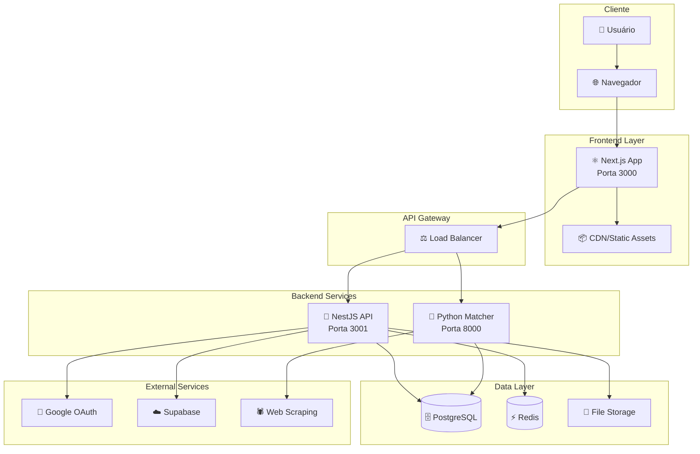

## 🔄 Fluxo de Autenticação

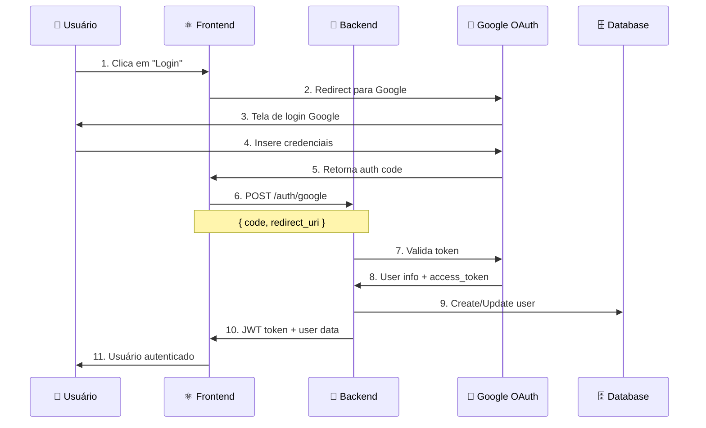

## 📦 Fluxo de Adição de Produto

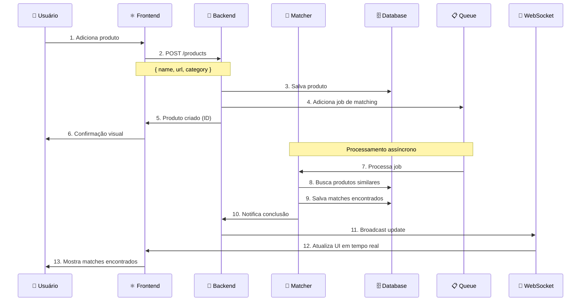

## 🏢 Estrutura do Monorepo

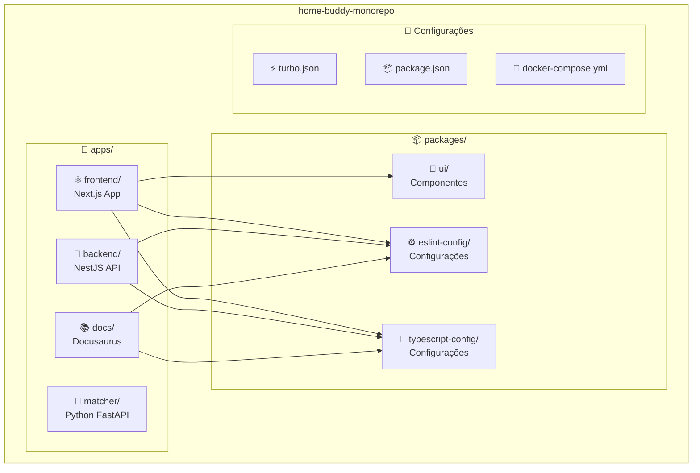

## 🔧 Arquitetura Interna do Backend

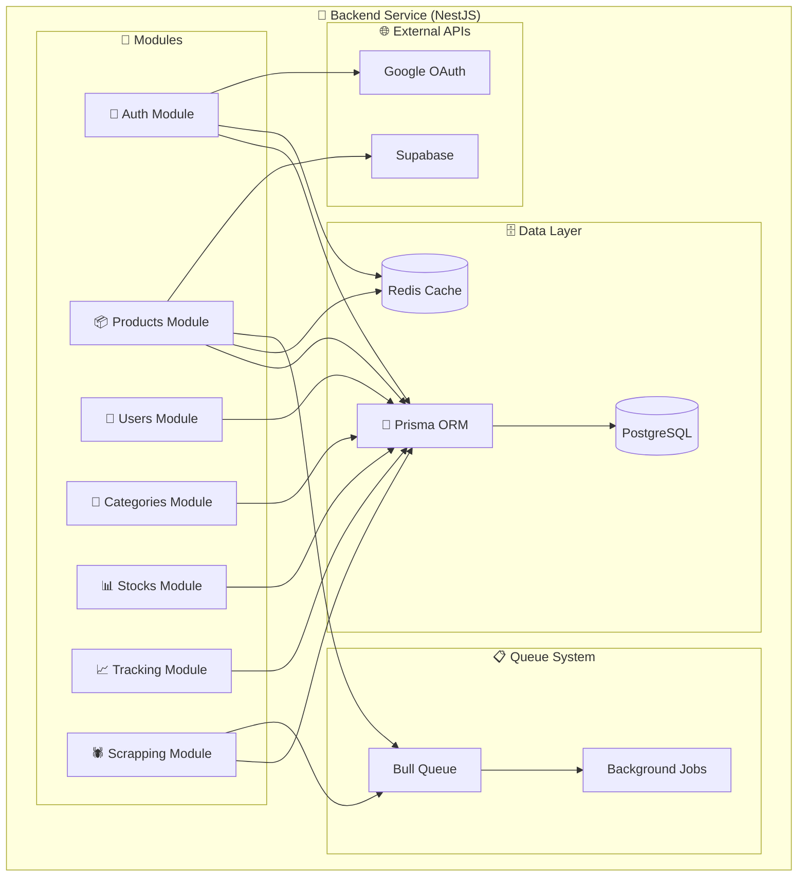

## 🤖 Arquitetura do Matcher Service

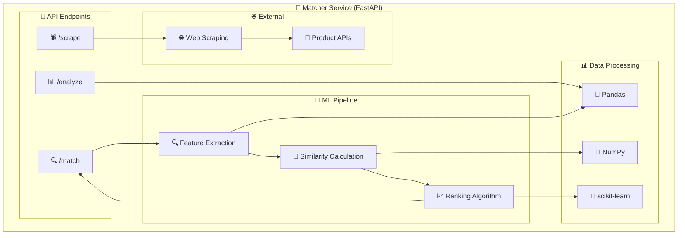

## 🔄 Fluxo de Matching de Produtos

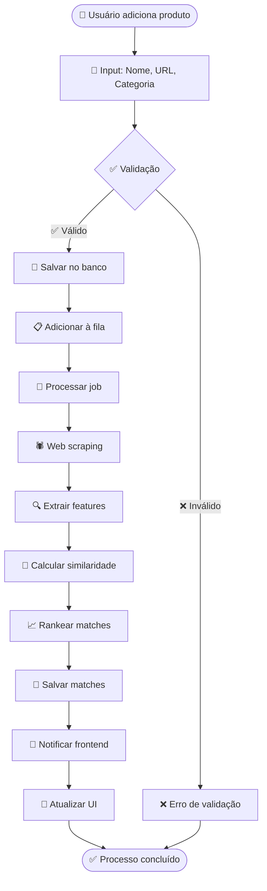

## 📊 Fluxo de Dados do Sistema

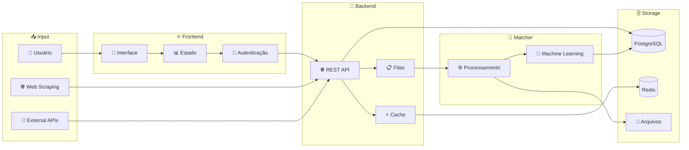

## 🚀 Deploy e Infraestrutura

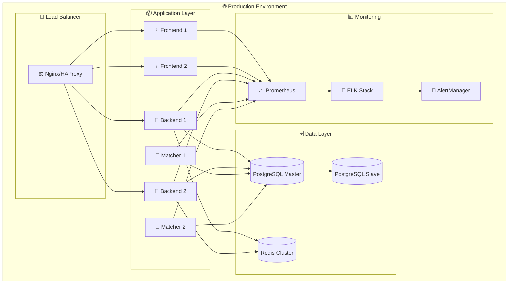

## 🔒 Fluxo de Segurança

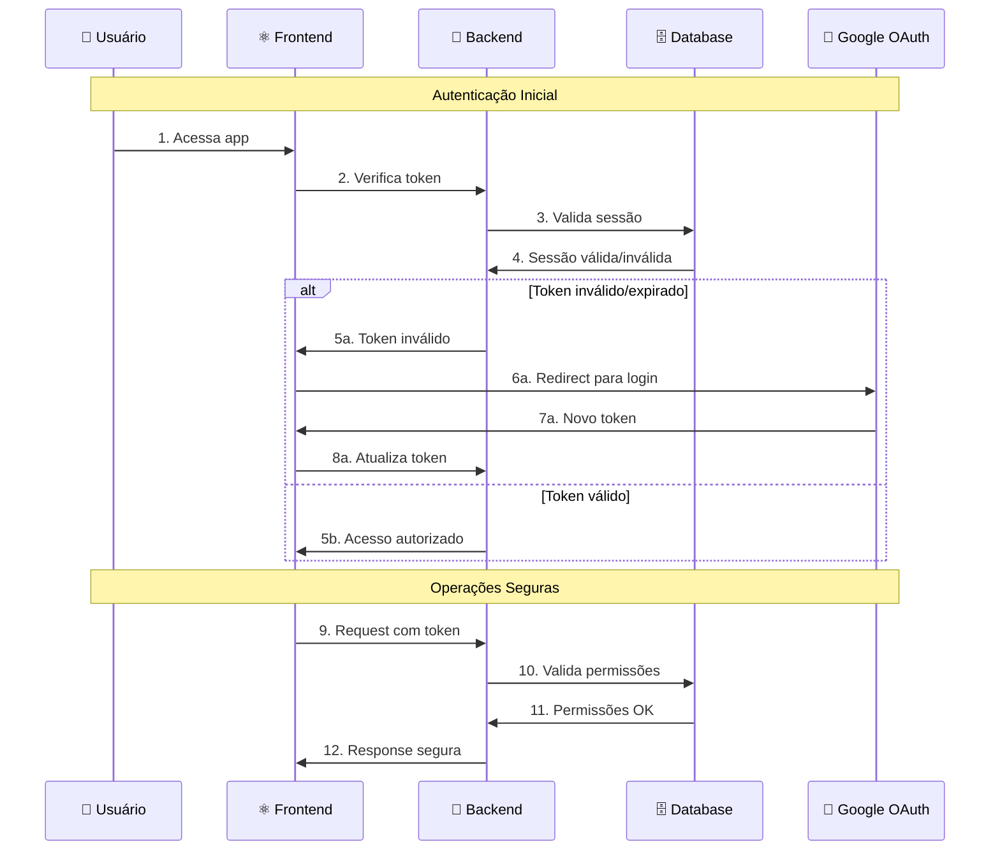

## 📈 Métricas e Monitoramento

```mermaid
graph TB
    subgraph "📊 Application Metrics"
        RESPONSE[⏱️ Response Time]
        THROUGHPUT[📈 Throughput]
        ERRORS[❌ Error Rate]
        USERS[👥 Active Users]
    end

    subgraph "💻 System Metrics"
        CPU[🖥️ CPU Usage]
        MEMORY[🧠 Memory Usage]
        DISK[💾 Disk Usage]
        NETWORK[🌐 Network I/O]
    end

    subgraph "🗄️ Database Metrics"
        QUERIES[🔍 Query Performance]
        CONNECTIONS[🔗 Connections]
        LOCKS[🔒 Lock Contention]
        SIZE[📏 Database Size]
    end

    subgraph "📈 Business Metrics"
        PRODUCTS[📦 Products Added]
        MATCHES[🔍 Matches Found]
        USERS_ACTIVE[👤 Active Users]
        REVENUE[💰 Revenue]
    end

    subgraph "📊 Monitoring Stack"
        PROMETHEUS[📈 Prometheus]
        GRAFANA[📊 Grafana]
        ELK[📝 ELK Stack]
        ALERTS[🚨 AlertManager]
    end

    RESPONSE --> PROMETHEUS
    THROUGHPUT --> PROMETHEUS
    ERRORS --> PROMETHEUS
    USERS --> PROMETHEUS

    CPU --> PROMETHEUS
    MEMORY --> PROMETHEUS
    DISK --> PROMETHEUS
    NETWORK --> PROMETHEUS

    QUERIES --> PROMETHEUS
    CONNECTIONS --> PROMETHEUS
    LOCKS --> PROMETHEUS
    SIZE --> PROMETHEUS

    PRODUCTS --> PROMETHEUS
    MATCHES --> PROMETHEUS
    USERS_ACTIVE --> PROMETHEUS
    REVENUE --> PROMETHEUS

    PROMETHEUS --> GRAFANA
    PROMETHEUS --> ELK
    PROMETHEUS --> ALERTS
```

## 📚 Próximos Passos

1. **[Backend API](/docs/backend/api-reference)** - Documentação completa da API
2. **[Frontend Components](/docs/frontend/components)** - Biblioteca de componentes
3. **[Deploy](/docs/deployment/docker)** - Guias de deploy

## 🆘 Precisa de Ajuda?

- **GitHub Issues**: [Reportar problemas](https://github.com/home-buddy/home-buddy-monorepo/issues)
- **Discord**: [Comunidade](https://discord.gg/home-buddy)
- **Email**: [suporte@homebuddy.com](mailto:suporte@homebuddy.com)
