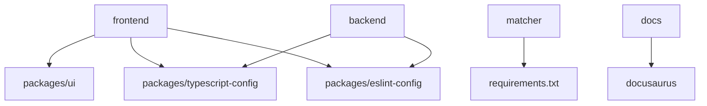

# 📁 Estrutura do Monorepo

O Home Buddy utiliza uma arquitetura de monorepo moderna, organizando múltiplos projetos em um único repositório com ferramentas especializadas para gerenciamento eficiente.

## 🎯 Benefícios do Monorepo

### **1. Código Compartilhado**

- Componentes UI reutilizáveis
- Configurações TypeScript/ESLint unificadas
- Tipos TypeScript compartilhados
- Utilitários comuns

### **2. Versionamento Unificado**

- Releases coordenados
- Breaking changes controlados
- Dependências sincronizadas
- Histórico único

### **3. Desenvolvimento Simplificado**

- Setup único para todo o projeto
- Scripts centralizados
- CI/CD unificado
- Debugging cross-service

## 🏗️ Organização do Projeto

```
home-buddy-monorepo/
├── 📁 apps/                    # Aplicações principais
│   ├── 📁 frontend/           # Next.js App (Porta 3000)
│   ├── 📁 backend/            # NestJS API (Porta 3001)
│   ├── 📁 matcher/            # Python FastAPI (Porta 8000)
│   └── 📁 docs/               # Docusaurus (Porta 3002)
├── 📁 packages/               # Pacotes compartilhados
│   ├── 📁 ui/                 # Componentes UI
│   ├── 📁 eslint-config/      # Configurações ESLint
│   └── 📁 typescript-config/   # Configurações TypeScript
├── 📄 docker-compose.yml      # Orquestração local
├── 📄 turbo.json             # Configuração Turbo
├── 📄 package.json            # Workspace raiz
├── 📄 yarn.lock              # Lock file
└── 📄 README.md              # Documentação principal
```

## 📦 Estrutura Detalhada por App

### **Frontend (`apps/frontend/`)**

```
frontend/
├── 📁 src/
│   ├── 📁 app/               # App Router (Next.js 14)
│   │   ├── 📁 (private)/     # Rotas privadas
│   │   ├── 📁 (public)/      # Rotas públicas
│   │   ├── 📁 api/          # API Routes
│   │   └── 📄 layout.tsx    # Layout raiz
│   ├── 📁 components/        # Componentes React
│   ├── 📁 hooks/            # Custom hooks
│   ├── 📁 lib/              # Utilitários
│   └── 📁 context/          # Context providers
├── 📁 public/               # Assets estáticos
├── 📄 package.json          # Dependências frontend
├── 📄 next.config.ts        # Configuração Next.js
├── 📄 tailwind.config.ts    # Configuração Tailwind
└── 📄 tsconfig.json         # Configuração TypeScript
```

### **Backend (`apps/backend/`)**

```
backend/
├── 📁 src/
│   ├── 📁 auth/             # Autenticação
│   ├── 📁 categories/       # Categorias
│   ├── 📁 common/           # Utilitários comuns
│   ├── 📁 products/         # Produtos
│   ├── 📁 users/            # Usuários
│   ├── 📁 stocks/           # Estoque
│   ├── 📁 tracking/         # Sistema de tracking
│   ├── 📁 scrapping/        # Web scraping
│   ├── 📁 export/           # Exportação de dados
│   ├── 📁 redis/            # Cache Redis
│   ├── 📁 prisma/           # Configuração Prisma
│   └── 📄 main.ts          # Entry point
├── 📁 prisma/               # Schema e migrações
├── 📁 test/                 # Testes
├── 📄 package.json          # Dependências backend
├── 📄 Dockerfile           # Container backend
└── 📄 tsconfig.json        # Configuração TypeScript
```

### **Matcher (`apps/matcher/`)**

```
matcher/
├── 📁 app/
│   ├── 📁 api/              # Endpoints FastAPI
│   ├── 📁 core/             # Configurações core
│   ├── 📁 dependencies/     # Dependências
│   ├── 📁 schemas/          # Schemas Pydantic
│   └── 📁 services/         # Lógica de negócio
├── 📁 tests/                # Testes Python
├── 📄 main.py              # Entry point
├── 📄 requirements.txt      # Dependências Python
├── 📄 Dockerfile           # Container matcher
└── 📄 README.md           # Documentação matcher
```

### **Docs (`apps/docs/`)**

```
docs/
├── 📁 docs/                # Documentação Markdown
│   ├── 📁 getting-started/ # Guias de início
│   ├── 📁 architecture/    # Arquitetura
│   ├── 📁 backend/         # Backend docs
│   ├── 📁 frontend/         # Frontend docs
│   ├── 📁 matcher/         # Matcher docs
│   ├── 📁 deployment/      # Deploy docs
│   └── 📁 contributing/    # Contribuindo
├── 📁 blog/                # Blog posts
├── 📁 src/                 # Componentes customizados
├── 📁 static/              # Assets estáticos
├── 📄 docusaurus.config.ts # Configuração Docusaurus
├── 📄 sidebars.ts          # Configuração sidebar
└── 📄 package.json         # Dependências docs
```

## 📦 Pacotes Compartilhados

### **UI Package (`packages/ui/`)**

```typescript
// Componentes reutilizáveis
export { Button } from './src/button'
export { Card } from './src/card'
export { Code } from './src/code'

// Configuração Tailwind
export const tailwindConfig = {
  // Configurações compartilhadas
}
```

### **ESLint Config (`packages/eslint-config/`)**

```javascript
// Configurações ESLint compartilhadas
module.exports = {
  extends: ['@home-buddy/eslint-config/base'],
  rules: {
    // Regras específicas
  },
}
```

### **TypeScript Config (`packages/typescript-config/`)**

```json
{
  "extends": "@home-buddy/typescript-config/base",
  "compilerOptions": {
    "baseUrl": ".",
    "paths": {
      "@/*": ["./src/*"]
    }
  }
}
```

## ⚙️ Ferramentas de Gerenciamento

### **Turbo (`turbo.json`)**

```json
{
  "pipeline": {
    "build": {
      "dependsOn": ["^build"],
      "outputs": ["dist/**", ".next/**"]
    },
    "dev": {
      "cache": false,
      "persistent": true
    },
    "lint": {
      "outputs": []
    },
    "test": {
      "outputs": ["coverage/**"]
    }
  }
}
```

### **Yarn Workspaces (`package.json`)**

```json
{
  "workspaces": ["apps/*", "packages/*"],
  "scripts": {
    "build": "turbo build",
    "dev": "turbo dev",
    "lint": "turbo lint",
    "test": "turbo test"
  }
}
```

## 🔄 Fluxo de Desenvolvimento

### **1. Setup Inicial**

```bash
# Clone do repositório
git clone https://github.com/home-buddy/home-buddy-monorepo.git
cd home-buddy-monorepo

# Instalar dependências
yarn install

# Build inicial
yarn build
```

### **2. Desenvolvimento**

```bash
# Desenvolvimento de todos os apps
yarn dev

# Desenvolvimento específico
yarn workspace frontend dev
yarn workspace backend dev
yarn workspace matcher dev
yarn workspace docs dev
```

### **3. Build e Deploy**

```bash
# Build completo
yarn build

# Build específico
yarn workspace frontend build
yarn workspace backend build

# Deploy
yarn deploy
```

## 📊 Dependências e Relacionamentos

### **Dependências Internas**



### **Dependências Externas**

- **Frontend**: React, Next.js, Tailwind CSS
- **Backend**: NestJS, Prisma, PostgreSQL
- **Matcher**: FastAPI, scikit-learn, pandas
- **Docs**: Docusaurus, React

## 🚀 Scripts Úteis

### **Scripts do Workspace Raiz**

```bash
# Desenvolvimento
yarn dev                    # Todos os apps
yarn dev:frontend          # Apenas frontend
yarn dev:backend           # Apenas backend
yarn dev:matcher           # Apenas matcher
yarn docs:dev              # Apenas documentação

# Build
yarn build                 # Build completo
yarn build:frontend       # Build frontend
yarn build:backend        # Build backend

# Testes
yarn test                 # Todos os testes
yarn test:frontend        # Testes frontend
yarn test:backend         # Testes backend
yarn test:matcher         # Testes matcher

# Linting
yarn lint                 # Lint completo
yarn lint:fix             # Lint com correção

# Limpeza
yarn clean                # Limpar builds
yarn clean:all            # Limpar tudo
```

### **Scripts por Workspace**

```bash
# Frontend
yarn workspace frontend dev
yarn workspace frontend build
yarn workspace frontend test

# Backend
yarn workspace backend start:dev
yarn workspace backend build
yarn workspace backend test

# Matcher
yarn workspace matcher dev
yarn workspace matcher test

# Docs
yarn workspace docs start
yarn workspace docs build
```

## 🔧 Configurações Específicas

### **TypeScript Path Mapping**

```json
{
  "compilerOptions": {
    "baseUrl": ".",
    "paths": {
      "@/*": ["./src/*"],
      "@/components/*": ["./src/components/*"],
      "@/lib/*": ["./src/lib/*"],
      "@/hooks/*": ["./src/hooks/*"]
    }
  }
}
```

### **ESLint Configuração**

```javascript
module.exports = {
  extends: [
    '@home-buddy/eslint-config/base',
    '@home-buddy/eslint-config/next', // Para Next.js
  ],
  rules: {
    // Regras específicas do projeto
  },
}
```

## 📈 Benefícios da Estrutura Atual

### **1. Desenvolvimento**

- ✅ Setup único para todo o projeto
- ✅ Hot reload em todos os serviços
- ✅ Debugging cross-service
- ✅ Refactoring seguro

### **2. Manutenção**

- ✅ Dependências centralizadas
- ✅ Versionamento unificado
- ✅ Releases coordenados
- ✅ Rollback simplificado

### **3. Performance**

- ✅ Build cache compartilhado
- ✅ Dependências otimizadas
- ✅ Bundle splitting eficiente
- ✅ Tree shaking automático

## 🔮 Evolução da Estrutura

### **Próximas Melhorias**

- Micro-frontends com Module Federation
- Package versioning automático
- Dependency graph visualization
- Automated dependency updates

### **Considerações Futuras**

- Monorepo tools avançados (Nx, Lerna)
- Package publishing automático
- Cross-package testing
- Performance monitoring

## 📚 Próximos Passos

1. **[Serviços](/docs/architecture/services)** - Detalhes de cada serviço
2. **[Backend](/docs/backend/api-reference)** - Documentação da API
3. **[Frontend](/docs/frontend/components)** - Biblioteca de componentes

## 🆘 Precisa de Ajuda?

- **GitHub Issues**: [Reportar problemas](https://github.com/home-buddy/home-buddy-monorepo/issues)
- **Discord**: [Comunidade](https://discord.gg/home-buddy)
- **Email**: [suporte@homebuddy.com](mailto:suporte@homebuddy.com)
