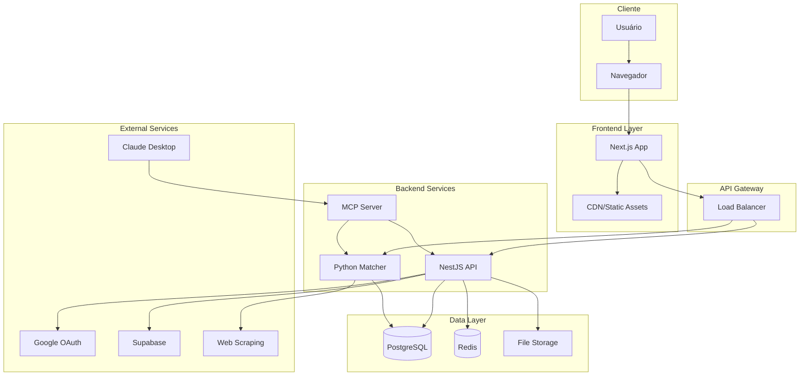
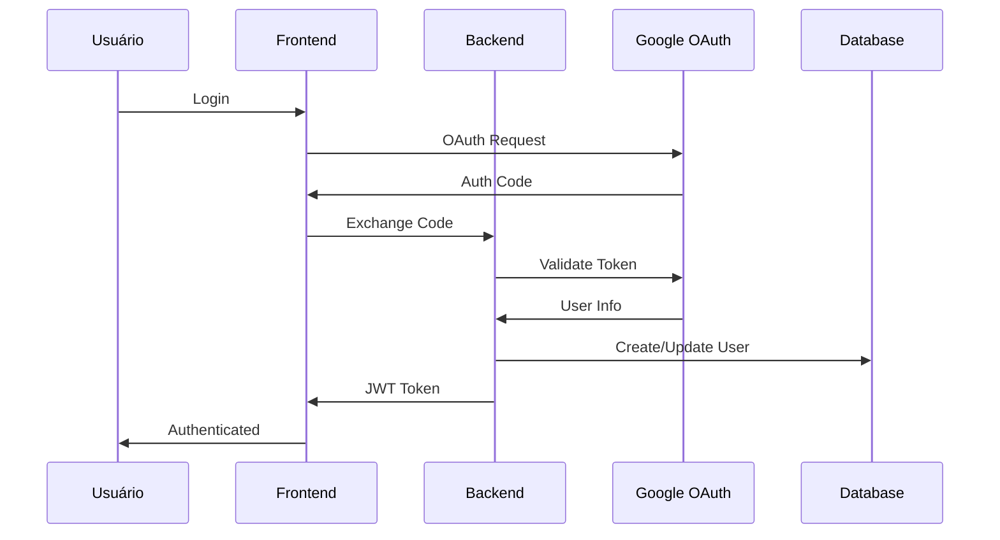
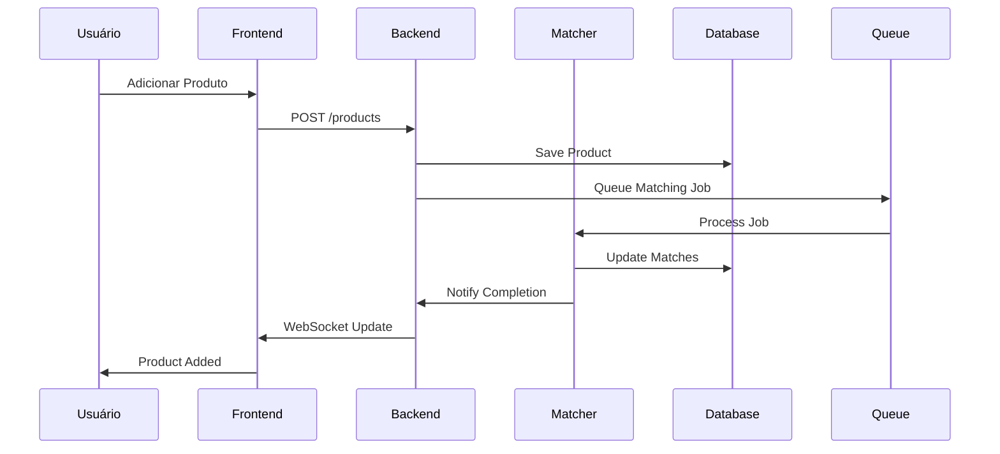

# 🏗️ Visão Geral da Arquitetura

O Home Buddy é um sistema de gestão doméstica inteligente construído com uma arquitetura moderna de monorepo, utilizando microserviços especializados para diferentes funcionalidades.

## 🎯 Princípios Arquiteturais

### **1. Monorepo com Microserviços**

- **Benefício**: Código compartilhado, versionamento unificado, deploy coordenado
- **Implementação**: Turbo + Yarn Workspaces para gerenciamento eficiente

### **2. Separação de Responsabilidades**

- **Frontend**: Interface de usuário e experiência
- **Backend**: Lógica de negócio e API
- **Matcher**: Processamento de IA e matching
- **Documentação**: Conhecimento e guias

### **3. Escalabilidade Horizontal**

- Cada serviço pode ser escalado independentemente
- Containerização com Docker para deploy consistente
- Cache distribuído com Redis

### **4. Observabilidade**

- Logs centralizados
- Métricas de performance
- Sistema de tracking de operações
- Health checks automatizados

## 🏛️ Arquitetura de Alto Nível



## 🔄 Fluxo de Dados Principal

### **1. Autenticação e Autorização**



### **2. Processamento de Produtos**



## 🏢 Estrutura do Monorepo

```
home-buddy-monorepo/
├── apps/
│   ├── frontend/          # Next.js App
│   ├── backend/           # NestJS API
│   ├── matcher/           # Python FastAPI
│   ├── mcp-server/        # MCP Server
│   └── docs/              # Docusaurus
├── packages/
│   ├── ui/                # Componentes compartilhados
│   ├── eslint-config/     # Configurações ESLint
│   └── typescript-config/ # Configurações TypeScript
├── docker-compose.yml     # Orquestração local
├── turbo.json            # Configuração Turbo
└── package.json           # Workspace raiz
```

## 🔧 Tecnologias por Camada

### **Frontend Layer**

- **Framework**: Next.js 14 (App Router)
- **Linguagem**: TypeScript
- **Styling**: Tailwind CSS + Shadcn/ui
- **Estado**: React Query + Zustand
- **Autenticação**: NextAuth.js

### **Backend Layer**

- **Framework**: NestJS
- **Linguagem**: TypeScript
- **ORM**: Prisma
- **Cache**: Redis
- **Filas**: Bull Queue
- **Autenticação**: JWT + Passport

### **AI/ML Layer**

- **Framework**: FastAPI
- **Linguagem**: Python
- **ML**: scikit-learn + pandas
- **Processamento**: Async/await
- **Validação**: Pydantic

### **MCP Layer**

- **Framework**: Model Context Protocol
- **Linguagem**: TypeScript
- **Integração**: Claude Desktop
- **Comunicação**: Stdio/HTTP
- **Validação**: Zod

### **Data Layer**

- **Database**: PostgreSQL
- **Cache**: Redis
- **Migrations**: Prisma
- **Backup**: Automated snapshots

## 🌐 Comunicação Entre Serviços

### **Síncrona (HTTP/REST)**

- Frontend ↔ Backend
- Backend ↔ Matcher
- MCP Server ↔ Backend
- MCP Server ↔ Matcher
- External APIs ↔ Backend

### **Assíncrona (Queues)**

- Product matching jobs
- Email notifications
- Data processing tasks

### **Real-time (WebSocket)**

- Live updates
- Progress notifications
- Real-time collaboration

### **MCP Protocol**

- Claude Desktop ↔ MCP Server
- Tools, Resources, Prompts
- Secure token-based authentication

## 📊 Padrões de Dados

### **Entidades Principais**

- **User**: Informações do usuário
- **Product**: Produtos rastreados
- **Store**: Lojas parceiras
- **Price**: Histórico de preços
- **Match**: Correspondências encontradas

### **Relacionamentos**

- User 1:N Products
- Product 1:N Prices
- Product 1:N Matches
- Store 1:N Products

## 🔒 Segurança

### **Autenticação**

- JWT tokens com refresh
- Google OAuth integration
- Session management

### **Autorização**

- Role-based access control
- Resource-level permissions
- API rate limiting

### **Proteção de Dados**

- HTTPS everywhere
- Input validation
- SQL injection prevention
- XSS protection

## 📈 Escalabilidade

### **Horizontal Scaling**

- Stateless services
- Load balancing
- Database sharding
- CDN for static assets

### **Performance**

- Redis caching
- Database indexing
- Query optimization
- Image optimization

### **Monitoring**

- Application metrics
- Error tracking
- Performance monitoring
- Health checks

## 🚀 Deploy e DevOps

### **Containerização**

- Docker para todos os serviços
- Docker Compose para desenvolvimento
- Kubernetes para produção

### **CI/CD**

- GitHub Actions
- Automated testing
- Staging environments
- Blue-green deployment

### **Infraestrutura**

- Cloud providers (AWS/GCP)
- Container orchestration
- Auto-scaling
- Backup strategies

## 🔮 Evolução da Arquitetura

### **Próximas Melhorias**

- Service mesh (Istio)
- Event-driven architecture
- GraphQL API
- Real-time analytics

### **Considerações Futuras**

- Multi-tenancy
- Internationalization
- Mobile apps
- IoT integration

## 📚 Próximos Passos

1. **[Estrutura do Monorepo](/docs/architecture/monorepo-structure)** - Detalhes da organização
2. **[Serviços](/docs/architecture/services)** - Especificações de cada serviço
3. **[Backend](/docs/backend/api-reference)** - Documentação da API

## 🆘 Precisa de Ajuda?

- **GitHub Issues**: [Reportar problemas](https://github.com/home-buddy/home-buddy-monorepo/issues)
- **Discord**: [Comunidade](https://discord.gg/home-buddy)
- **Email**: [suporte@homebuddy.com](mailto:suporte@homebuddy.com)
