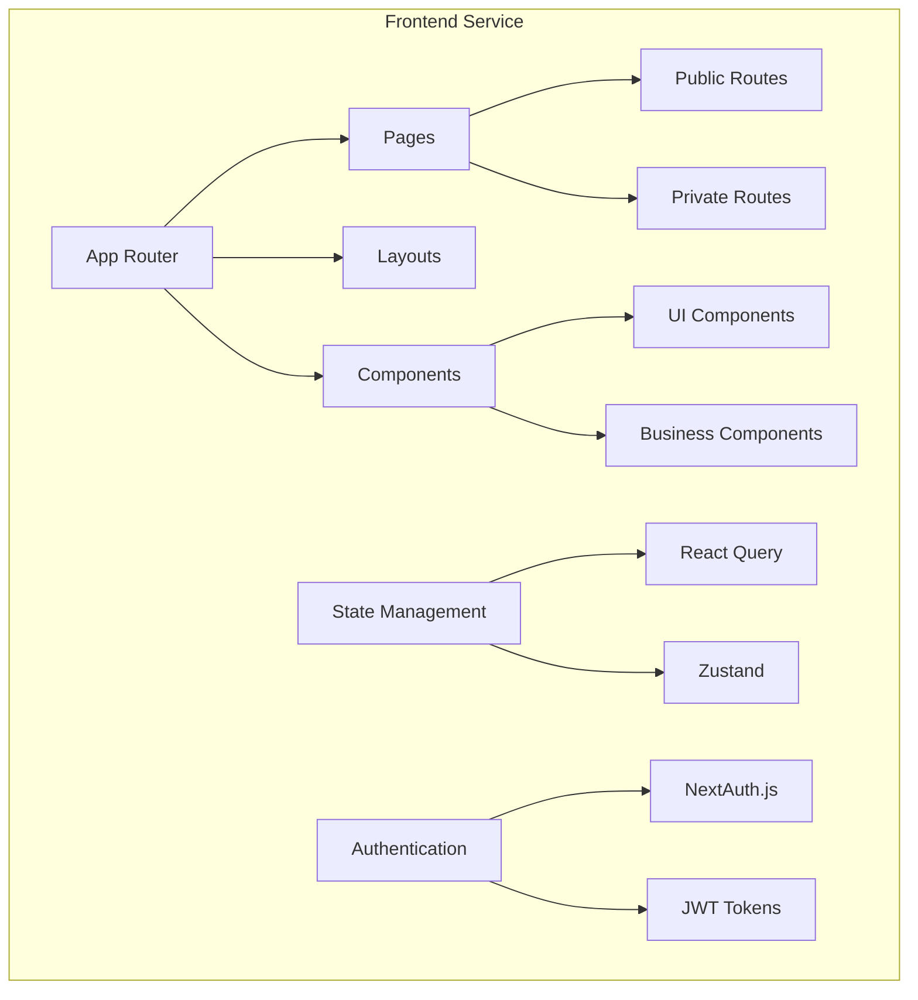
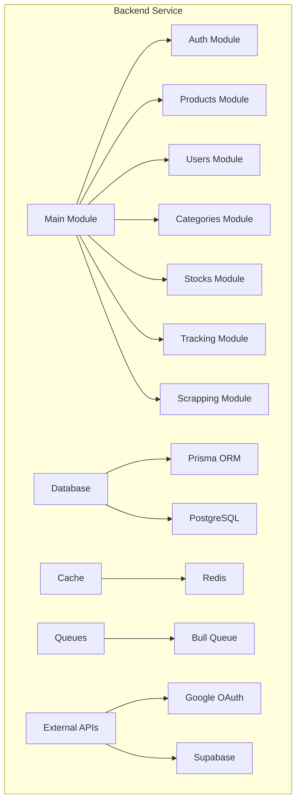
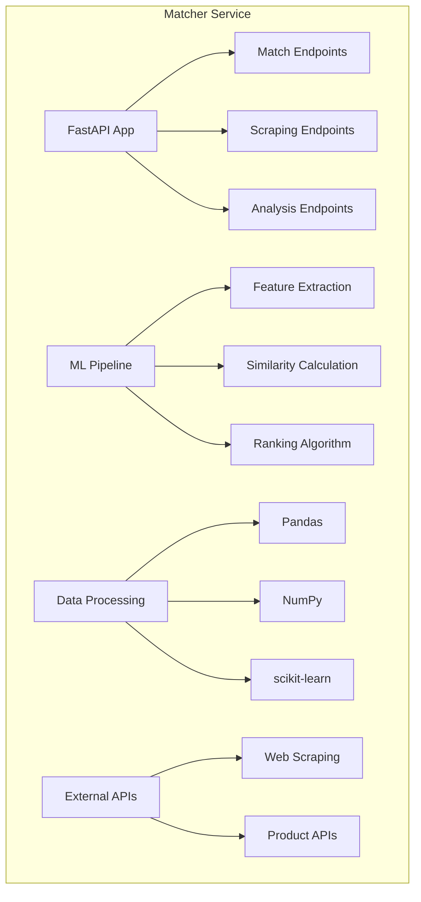

# 🔧 Serviços do Sistema

O Home Buddy é composto por múltiplos serviços especializados, cada um com responsabilidades específicas e tecnologias otimizadas para sua função.

## 🎨 Frontend Service

### **Tecnologia**: Next.js 14 + TypeScript

### **Porta**: 3000

### **Responsabilidades**

- **Interface de Usuário**: Páginas e componentes React
- **Autenticação**: Gerenciamento de sessão e tokens
- **Estado Global**: Gerenciamento de estado da aplicação
- **Roteamento**: Navegação e roteamento client-side
- **Otimização**: SSR, SSG, e otimizações de performance

### **Arquitetura Interna**



### **Principais Funcionalidades**

#### **1. Autenticação**

- Login com Google OAuth
- Gerenciamento de sessão
- Proteção de rotas privadas
- Refresh automático de tokens

#### **2. Gestão de Produtos**

- Listagem de produtos
- Adição de novos produtos
- Edição e exclusão
- Filtros e busca

#### **3. Dashboard**

- Visão geral dos gastos
- Gráficos e métricas
- Notificações em tempo real
- Histórico de preços

#### **4. Configurações**

- Perfil do usuário
- Preferências de notificação
- Configurações de conta
- Exportação de dados

### **Tecnologias Utilizadas**

```typescript
// Principais dependências
{
  "next": "14.x",
  "react": "19.x",
  "typescript": "5.x",
  "tailwindcss": "3.x",
  "@tanstack/react-query": "5.x",
  "zustand": "4.x",
  "next-auth": "4.x",
  "shadcn/ui": "latest"
}
```

## ⚙️ Backend Service

### **Tecnologia**: NestJS + TypeScript

### **Porta**: 3001

### **Responsabilidades**

- **API RESTful**: Endpoints para todas as operações
- **Autenticação**: JWT e OAuth integration
- **Banco de Dados**: Operações CRUD com Prisma
- **Filas**: Processamento assíncrono com Bull
- **Cache**: Redis para performance
- **Tracking**: Sistema de rastreamento de operações

### **Arquitetura Interna**



### **Principais Módulos**

#### **1. Auth Module**

```typescript
// Autenticação e autorização
@Controller('auth')
export class AuthController {
  @Post('login')
  async login(@Body() loginDto: LoginDto) {
    // Implementação do login
  }

  @Post('google')
  async googleAuth(@Body() googleDto: GoogleAuthDto) {
    // OAuth com Google
  }

  @Post('refresh')
  async refreshToken(@Body() refreshDto: RefreshTokenDto) {
    // Refresh de token
  }
}
```

#### **2. Products Module**

```typescript
// Gestão de produtos
@Controller('products')
export class ProductsController {
  @Get()
  async findAll(@Query() query: FindProductsDto) {
    // Listagem com filtros
  }

  @Post()
  async create(@Body() createDto: CreateProductDto) {
    // Criação de produto
  }

  @Put(':id')
  async update(@Param('id') id: string, @Body() updateDto: UpdateProductDto) {
    // Atualização de produto
  }
}
```

#### **3. Tracking Module**

```typescript
// Sistema de tracking
@Controller('tracking')
export class TrackingController {
  @Post('operation')
  async trackOperation(@Body() operationDto: TrackOperationDto) {
    // Rastreamento de operações
  }

  @Get('history')
  async getHistory(@Query() query: GetHistoryDto) {
    // Histórico de operações
  }
}
```

### **Tecnologias Utilizadas**

```typescript
// Principais dependências
{
  "@nestjs/core": "10.x",
  "@nestjs/common": "10.x",
  "@nestjs/platform-express": "10.x",
  "@nestjs/jwt": "10.x",
  "@nestjs/passport": "10.x",
  "@prisma/client": "5.x",
  "prisma": "5.x",
  "bull": "4.x",
  "redis": "4.x",
  "class-validator": "0.x",
  "class-transformer": "0.x"
}
```

## 🔍 Matcher Service

### **Tecnologia**: FastAPI + Python

### **Porta**: 8000

### **Responsabilidades**

- **Matching de Produtos**: Algoritmos de similaridade
- **Processamento de IA**: Machine learning para matching
- **Web Scraping**: Coleta de dados de produtos
- **Análise de Dados**: Processamento e análise
- **API Especializada**: Endpoints para matching

### **Arquitetura Interna**



### **Principais Funcionalidades**

#### **1. Product Matching**

```python
# Algoritmo de matching
@app.post("/match")
async def match_products(product_data: ProductData):
    # Extração de features
    features = extract_features(product_data)

    # Cálculo de similaridade
    similarities = calculate_similarity(features)

    # Ranking e retorno
    matches = rank_matches(similarities)
    return matches
```

#### **2. Web Scraping**

```python
# Coleta de dados
@app.post("/scrape")
async def scrape_product(url: str):
    # Scraping do produto
    product_data = scrape_product_data(url)

    # Processamento dos dados
    processed_data = process_scraped_data(product_data)

    return processed_data
```

#### **3. Data Analysis**

```python
# Análise de dados
@app.get("/analyze")
async def analyze_products():
    # Análise estatística
    analysis = perform_statistical_analysis()

    # Insights e tendências
    insights = generate_insights(analysis)

    return insights
```

### **Tecnologias Utilizadas**

```python
# requirements.txt
fastapi==0.104.1
uvicorn==0.24.0
pydantic==2.5.0
pandas==2.1.3
numpy==1.25.2
scikit-learn==1.3.2
requests==2.31.0
beautifulsoup4==4.12.2
```

## 📚 Documentation Service

### **Tecnologia**: Docusaurus

### **Porta**: 3002

### **Responsabilidades**

- **Documentação**: Guias e referências
- **Blog**: Posts e atualizações
- **API Docs**: Documentação interativa
- **Tutoriais**: Guias passo a passo

### **Estrutura da Documentação**

```
docs/
├── getting-started/     # Guias de início
├── architecture/       # Arquitetura do sistema
├── backend/          # Documentação backend
├── frontend/         # Documentação frontend
├── matcher/          # Documentação matcher
├── deployment/       # Guias de deploy
└── contributing/     # Guias para contribuidores
```

## 🔄 Comunicação Entre Serviços

### **1. Frontend ↔ Backend**

```typescript
// Comunicação HTTP/REST
const api = axios.create({
  baseURL: process.env.NEXT_PUBLIC_API_URL,
  headers: {
    Authorization: `Bearer ${token}`,
  },
})

// Exemplo de uso
const products = await api.get('/products')
```

### **2. Backend ↔ Matcher**

```typescript
// Comunicação entre serviços
@Injectable()
export class MatcherService {
  async matchProduct(productData: any) {
    const response = await this.httpService
      .post(`${this.matcherUrl}/match`, productData)
      .toPromise()

    return response.data
  }
}
```

### **3. WebSocket (Real-time)**

```typescript
// Comunicação em tempo real
const socket = io(process.env.NEXT_PUBLIC_API_URL)

socket.on('product-matched', (data) => {
  // Atualizar UI em tempo real
  updateProductMatches(data)
})
```

## 📊 Monitoramento e Observabilidade

### **Health Checks**

```typescript
// Health check para cada serviço
@Get('health')
async healthCheck() {
  return {
    status: 'ok',
    timestamp: new Date().toISOString(),
    uptime: process.uptime(),
    memory: process.memoryUsage()
  };
}
```

### **Métricas**

- **Performance**: Response time, throughput
- **Errors**: Error rate, error types
- **Resources**: CPU, memory, disk usage
- **Business**: User actions, product matches

### **Logs**

- **Structured Logging**: JSON format
- **Log Levels**: DEBUG, INFO, WARN, ERROR
- **Correlation IDs**: Rastreamento de requests
- **Centralized Logging**: ELK Stack ou similar

## 🚀 Deploy e Escalabilidade

### **Containerização**

```dockerfile
# Dockerfile para cada serviço
FROM node:18-alpine
WORKDIR /app
COPY package*.json ./
RUN yarn install
COPY . .
RUN yarn build
EXPOSE 3000
CMD ["yarn", "start"]
```

### **Orquestração**

```yaml
# docker-compose.yml
version: '3.8'
services:
  frontend:
    build: ./apps/frontend
    ports:
      - '3000:3000'

  backend:
    build: ./apps/backend
    ports:
      - '3001:3001'

  matcher:
    build: ./apps/matcher
    ports:
      - '8000:8000'
```

### **Escalabilidade**

- **Horizontal Scaling**: Múltiplas instâncias
- **Load Balancing**: Distribuição de carga
- **Auto-scaling**: Baseado em métricas
- **Database Sharding**: Para grandes volumes

## 📚 Próximos Passos

1. **[Backend API](/docs/backend/api-reference)** - Documentação completa da API
2. **[Frontend Components](/docs/frontend/components)** - Biblioteca de componentes
3. **[Matcher API](/docs/matcher/api)** - Documentação do serviço de matching

## 🆘 Precisa de Ajuda?

- **GitHub Issues**: [Reportar problemas](https://github.com/home-buddy/home-buddy-monorepo/issues)
- **Discord**: [Comunidade](https://discord.gg/home-buddy)
- **Email**: [suporte@homebuddy.com](mailto:suporte@homebuddy.com)
