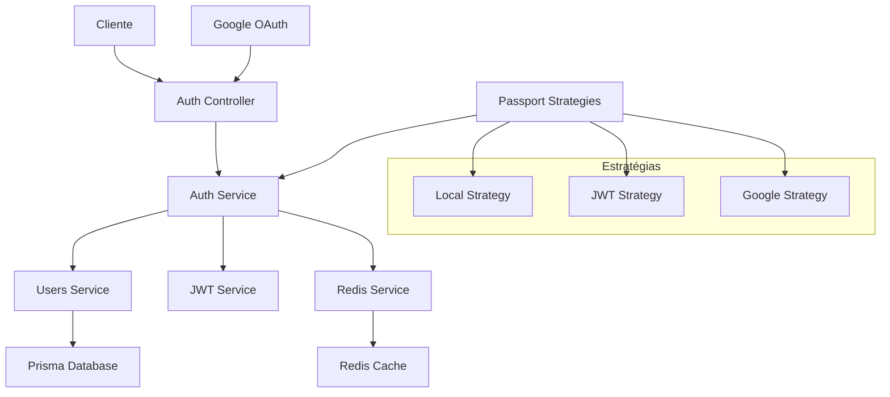

# Sistema de Autenticação

O Home Buddy implementa um sistema robusto de autenticação com suporte a login local, OAuth do Google e gerenciamento de sessões com Redis.

## Visão Geral

O sistema de autenticação utiliza:

- **JWT (JSON Web Tokens)** para autenticação stateless
- **Redis** para gerenciamento de sessões e tokens
- **Passport.js** para estratégias de autenticação
- **bcrypt** para hash de senhas
- **Cookies HTTP-only** para segurança adicional

## Arquitetura de Autenticação



## Fluxo de Autenticação

### 1. Registro de Usuário

```typescript
// Fluxo de registro
async signUp(createUserDto: CreateUserDto) {
  // 1. Verificar se usuário já existe
  const existingUser = await this.usersService.findByUsername(username);
  if (existingUser) throw new ConflictException('User already exists');

  // 2. Hash da senha
  const hashedPassword = await bcrypt.hash(password, 12);

  // 3. Criar usuário no banco
  const user = await this.usersService.createUser({
    username,
    email,
    password: hashedPassword
  });

  // 4. Gerar tokens JWT
  return this.generateTokens(user);
}
```

### 2. Login Local

```typescript
// Fluxo de login
async validateUser(username: string, password: string) {
  // 1. Buscar usuário
  const user = await this.usersService.findByUsername(username);
  if (!user) return null;

  // 2. Verificar senha
  const isMatch = await bcrypt.compare(password, user.password);
  if (!isMatch) return null;

  // 3. Atualizar último login
  await this.usersService.updateLastLogin(user.id);

  return { id: user.id, username: user.username, email: user.email };
}
```

### 3. Geração de Tokens

```typescript
private async generateTokens(user: AuthenticatedUser) {
  const jti = randomUUID(); // JWT ID único

  // Payload do token
  const payload = {
    username: user.username,
    sub: user.id,
    jti
  };

  // Access Token (15 minutos)
  const accessToken = this.jwtService.sign(payload, {
    expiresIn: '15m',
    secret: jwtConstants.accessSecret,
  });

  // Refresh Token (7 dias)
  const refreshToken = this.jwtService.sign(payload, {
    expiresIn: '7d',
    secret: jwtConstants.refreshSecret,
  });

  // Armazenar hashes no Redis
  await this.redisService.setToken(`accessToken:${jti}`, hashToken(accessToken), 900);
  await this.redisService.setToken(`refreshToken:${jti}`, hashToken(refreshToken), 604800);

  return { access_token: accessToken, refresh_token: refreshToken };
}
```

## Estratégias de Autenticação

### 1. Local Strategy

```typescript
@Injectable()
export class LocalStrategy extends PassportStrategy(Strategy) {
  constructor(private authService: AuthService) {
    super({
      usernameField: 'username',
      passwordField: 'password',
    })
  }

  async validate(username: string, password: string) {
    const user = await this.authService.validateUser(username, password)
    if (!user) {
      throw new UnauthorizedException()
    }
    return user
  }
}
```

### 2. JWT Strategy

```typescript
@Injectable()
export class JwtStrategy extends PassportStrategy(Strategy) {
  constructor(private redisService: RedisService) {
    super({
      jwtFromRequest: ExtractJwt.fromAuthHeaderAsBearerToken(),
      ignoreExpiration: false,
      secretOrKey: jwtConstants.accessSecret,
    })
  }

  async validate(payload: any) {
    const { sub: userId, jti } = payload

    // Verificar se token existe no Redis
    const tokenExists = await this.redisService.getToken(`accessToken:${jti}`)
    if (!tokenExists) {
      throw new UnauthorizedException('Token inválido')
    }

    return { userId, jti }
  }
}
```

### 3. Google OAuth Strategy

```typescript
@Injectable()
export class GoogleStrategy extends PassportStrategy(Strategy, 'google') {
  constructor(private authService: AuthService) {
    super({
      clientID: process.env.GOOGLE_CLIENT_ID,
      clientSecret: process.env.GOOGLE_CLIENT_SECRET,
      callbackURL: '/auth/google/callback',
      scope: ['email', 'profile'],
    })
  }

  async validate(accessToken: string, refreshToken: string, profile: any) {
    const googleUser = {
      email: profile.emails[0].value,
      username: profile.username,
      firstName: profile.name.givenName,
      lastName: profile.name.familyName,
      picture: profile.photos[0].value,
      googleId: profile.id,
    }

    return await this.authService.validateOrCreateGoogleUser(googleUser)
  }
}
```

## Guards de Autenticação

### JWT Auth Guard

```typescript
@Injectable()
export class JwtAuthGuard extends AuthGuard('jwt') {
  constructor(private redisService: RedisService) {
    super()
  }

  async canActivate(context: ExecutionContext): Promise<boolean> {
    const request = context.switchToHttp().getRequest()
    const token = this.extractTokenFromHeader(request)

    if (!token) {
      throw new UnauthorizedException('Token não fornecido')
    }

    try {
      const payload = await this.jwtService.verifyAsync(token, {
        secret: jwtConstants.accessSecret,
      })

      // Verificar token no Redis
      const tokenExists = await this.redisService.getToken(
        `accessToken:${payload.jti}`,
      )
      if (!tokenExists) {
        throw new UnauthorizedException('Token inválido')
      }

      request['user'] = payload
    } catch {
      throw new UnauthorizedException('Token inválido')
    }

    return true
  }
}
```

### Internal Guard

```typescript
@Injectable()
export class InternalGuard implements CanActivate {
  canActivate(context: ExecutionContext): boolean {
    const request = context.switchToHttp().getRequest()
    const internalKey = request.headers['x-internal-key']

    return internalKey === process.env.INTERNAL_API_KEY
  }
}
```

## Gerenciamento de Sessões

### Redis Service

```typescript
@Injectable()
export class RedisService {
  constructor(@InjectRedis() private readonly redis: Redis) {}

  async setToken(key: string, value: string, ttl: number): Promise<void> {
    await this.redis.setex(key, ttl, value)
  }

  async getToken(key: string): Promise<string | null> {
    return await this.redis.get(key)
  }

  async removeToken(key: string): Promise<void> {
    await this.redis.del(key)
  }

  async addUserSession(userId: number, jti: string): Promise<void> {
    await this.redis.sadd(`user:${userId}:sessions`, jti)
  }

  async removeUserSession(userId: number, jti: string): Promise<void> {
    await this.redis.srem(`user:${userId}:sessions`, jti)
  }
}
```

## Refresh Token

### Implementação

```typescript
async refreshToken(refreshToken: string) {
  try {
    // Verificar token
    const decoded = this.jwtService.verify(refreshToken, {
      secret: jwtConstants.refreshSecret,
    });

    const { sub: userId, jti } = decoded;

    // Verificar token no Redis
    const redisToken = await this.redisService.getToken(`refreshToken:${jti}`);
    const refreshTokenHash = createHash('sha256').update(refreshToken).digest('hex');

    if (redisToken !== refreshTokenHash) {
      throw new UnauthorizedException('Invalid refresh token');
    }

    // Buscar usuário
    const user = await this.usersService.findById(userId);
    if (!user) {
      throw new UnauthorizedException('User not found');
    }

    // Gerar novos tokens
    return this.generateTokens(user);
  } catch (error) {
    throw new UnauthorizedException('Invalid or expired refresh token');
  }
}
```

## Logout

### Implementação

```typescript
async logout(userId: number, accessToken: string): Promise<void> {
  if (!accessToken) return;

  try {
    const decoded = this.jwtService.verify(accessToken, {
      secret: jwtConstants.accessSecret,
      ignoreExpiration: true,
    });

    const jti = decoded?.jti;

    if (jti) {
      // Remover tokens do Redis
      await this.redisService.removeToken(`accessToken:${jti}`);
      await this.redisService.removeToken(`refreshToken:${jti}`);
      await this.redisService.removeUserSession(userId, jti);
    }
  } catch {
    // Token inválido, ignorar
  }
}
```

## Segurança

### Medidas Implementadas

1. **Hash de Senhas**: bcrypt com salt rounds 12
2. **Tokens JWT**: Assinados com secrets diferentes
3. **Redis Blacklist**: Tokens invalidados são armazenados
4. **HTTP-only Cookies**: Para tokens em produção
5. **CORS Configurado**: Apenas domínios permitidos
6. **Rate Limiting**: Limite de tentativas de login
7. **Validação de Input**: class-validator para DTOs

### Configuração de Cookies

```typescript
const cookieOptions = {
  httpOnly: true,
  secure: process.env.NODE_ENV === 'production',
  sameSite: process.env.NODE_ENV === 'production' ? 'strict' : 'lax',
  path: '/',
  domain:
    process.env.NODE_ENV === 'production'
      ? process.env.COOKIE_DOMAIN
      : undefined,
}
```

## Google OAuth

### Fluxo Completo

```typescript
async googleAuthCallback(req: AuthRequest, res: Response) {
  try {
    // Verificar conflitos de usuário
    if (req.user && typeof req.user === 'object' && 'error' in req.user) {
      if (req.user.error === 'user_conflict') {
        return res.send(`
          <script>
            window.opener.postMessage({
              error: 'user_conflict',
              message: 'Email já cadastrado com login local.'
            }, '${process.env.FRONTEND_URL}');
            window.close();
          </script>
        `);
      }
    }

    // Gerar tokens
    const tokens = await this.signIn(req.user);

    // Configurar cookies
    res.cookie('access_token', tokens.access_token, {
      ...cookieOptions,
      maxAge: 15 * 60 * 1000, // 15 minutos
    });

    res.cookie('refresh_token', tokens.refresh_token, {
      ...cookieOptions,
      maxAge: 7 * 24 * 60 * 60 * 1000, // 7 dias
    });

    // Retornar sucesso
    res.send(`
      <script>
        window.opener.postMessage({
          success: true,
          user: {
            id: '${req.user.id}',
            username: '${req.user.username}',
            email: '${req.user.email}'
          }
        }, '${process.env.FRONTEND_URL}');
        window.close();
      </script>
    `);
  } catch (error) {
    // Tratar erro
  }
}
```

## Middleware de Autenticação

### Aplicação Global

```typescript
// app.module.ts
@Module({
  providers: [
    {
      provide: APP_GUARD,
      useClass: JwtAuthGuard,
    },
  ],
})
export class AppModule {}
```

### Rotas Públicas

```typescript
// auth.controller.ts
@Controller('auth')
export class AuthController {
  @Post('signin')
  @UseGuards(LocalAuthGuard)
  async signIn(@Request() req) {
    return this.authService.signIn(req.user)
  }

  @Post('signup')
  async signUp(@Body() createUserDto: CreateUserDto) {
    return this.authService.signUp(createUserDto)
  }

  @Get('google')
  @UseGuards(AuthGuard('google'))
  async googleAuth() {
    // Inicia o fluxo OAuth
  }

  @Get('google/callback')
  @UseGuards(AuthGuard('google'))
  async googleAuthCallback(@Request() req, @Res() res) {
    return this.authService.googleAuthCallback(req, res)
  }
}
```

## Tratamento de Erros

### Exceções Personalizadas

```typescript
// auth.service.ts
async validateUser(username: string, password: string) {
  const user = await this.usersService.findByUsername(username);

  if (!user) {
    throw new UnauthorizedException('Credenciais inválidas');
  }

  const isMatch = await bcrypt.compare(password, user.password);

  if (!isMatch) {
    throw new UnauthorizedException('Credenciais inválidas');
  }

  return user;
}
```

## Monitoramento

### Logs de Autenticação

```typescript
@Injectable()
export class AuthService {
  private readonly logger = new Logger(AuthService.name)

  async signIn(user: AuthenticatedUser) {
    this.logger.log(`Usuário ${user.username} fez login`)
    await this.usersService.updateLastLogin(user.id)
    return this.generateTokens(user)
  }

  async logout(userId: number, accessToken: string) {
    this.logger.log(`Usuário ${userId} fez logout`)
    // ... implementação do logout
  }
}
```

## Configuração de Ambiente

### Variáveis Necessárias

```env
# JWT Secrets
JWT_ACCESS_SECRET=seu-access-secret-aqui
JWT_REFRESH_SECRET=seu-refresh-secret-aqui

# Google OAuth
GOOGLE_CLIENT_ID=seu-google-client-id
GOOGLE_CLIENT_SECRET=seu-google-client-secret

# Redis
REDIS_HOST=localhost
REDIS_PORT=6379
REDIS_PASSWORD=sua-senha-redis

# Cookies
COOKIE_DOMAIN=seu-dominio.com

# Frontend
FRONTEND_URL=http://localhost:1598
```

## Testes

### Teste de Autenticação

```typescript
describe('AuthService', () => {
  it('should validate user credentials', async () => {
    const result = await authService.validateUser('testuser', 'password123')
    expect(result).toBeDefined()
    expect(result.username).toBe('testuser')
  })

  it('should throw UnauthorizedException for invalid credentials', async () => {
    await expect(authService.validateUser('invalid', 'wrong')).rejects.toThrow(
      UnauthorizedException,
    )
  })
})
```
