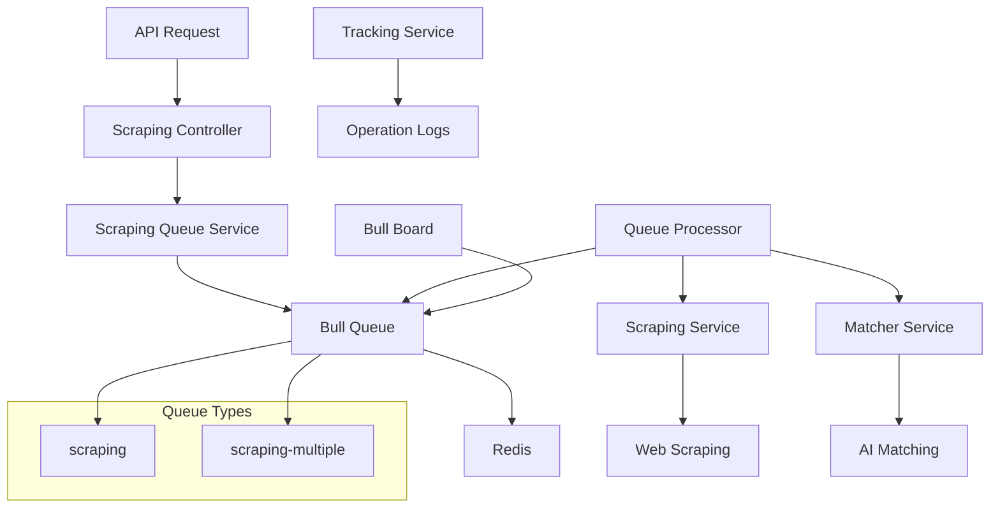

# Sistema de Filas

O Home Buddy utiliza Bull Queue com Redis para processamento assíncrono de tarefas, especialmente para operações de scraping e matching de produtos.

## Visão Geral

- **Queue Engine**: Bull Queue
- **Redis**: Backend para filas
- **Bull Board**: Interface web para monitoramento
- **Processamento**: Jobs assíncronos com retry automático
- **Monitoramento**: Logs detalhados e métricas

## Arquitetura das Filas



## Configuração do Bull

### Módulo Principal

```typescript
// app.module.ts
@Module({
  imports: [
    BullModule.forRoot({
      redis: {
        host: process.env.REDIS_HOST || 'localhost',
        port: parseInt(process.env.REDIS_PORT || '6379'),
        password: process.env.REDIS_PASSWORD,
      },
    }),
    BullBoardModule,
    ScrappingModule,
  ],
})
export class AppModule {}
```

### Configuração do Bull Board

```typescript
// bull-board.module.ts
import { BullBoardModule } from '@bull-board/nestjs'
import { ExpressAdapter } from '@bull-board/express'
import { BullAdapter } from '@bull-board/api/bullAdapter'

@Module({
  imports: [
    BullBoardModule.forRoot({
      route: '/admin/queues',
      adapter: ExpressAdapter,
    }),
    BullBoardModule.forFeature({
      name: 'scraping',
      adapter: BullAdapter,
    }),
  ],
})
export class BullBoardModule {}
```

## Scraping Queue Service

### Implementação Base

```typescript
// scrapping-queue.service.ts
import { Injectable, Logger } from '@nestjs/common'
import { InjectQueue } from '@nestjs/bull'
import { Queue, Job } from 'bull'

@Injectable()
export class ScrapingQueueService {
  private readonly logger = new Logger(ScrapingQueueService.name)

  constructor(@InjectQueue('scraping') private readonly scrapingQueue: Queue) {}

  async addScrapingJob(data: ScrapingJobData): Promise<Job<ScrapingJobData>> {
    this.logger.log(`Adicionando job de scraping para URL: ${data.url}`)

    const job = await this.scrapingQueue.add('scrape-nfc', data, {
      attempts: 3,
      backoff: {
        type: 'exponential',
        delay: 2000,
      },
      removeOnComplete: 100,
      removeOnFail: 50,
    })

    this.logger.log(`Job ${job.id} adicionado à fila`)
    return job
  }

  async addMultipleScrapingJobs(urls: string[], userId?: number): Promise<Job> {
    this.logger.log(
      `Adicionando job de scraping múltiplo para ${urls.length} URLs`,
    )

    const job = await this.scrapingQueue.add(
      'scrape-multiple',
      { urls, userId },
      {
        attempts: 2,
        backoff: {
          type: 'exponential',
          delay: 5000,
        },
        removeOnComplete: 50,
        removeOnFail: 25,
      },
    )

    this.logger.log(`Job múltiplo ${job.id} adicionado à fila`)
    return job
  }
}
```

### Tipos de Jobs

```typescript
// scrapping-queue.processor.ts
export interface ScrapingJobData {
  url: string
  userId?: number
  metadata?: any
}

export interface ScrapingJobResult {
  success: boolean
  data?: any
  error?: string
  matchResult?: MatchResult
}
```

## Queue Processor

### Implementação do Processor

```typescript
// scrapping-queue.processor.ts
import { Process, Processor } from '@nestjs/bull'
import { Job } from 'bull'
import { Logger } from '@nestjs/common'

@Processor('scraping')
export class ScrapingQueueProcessor {
  private readonly logger = new Logger(ScrapingQueueProcessor.name)

  constructor(
    private readonly scrapingService: ScrapingService,
    private readonly matcherService: MatcherService,
    private readonly trackingService: TrackingService,
  ) {}

  @Process('scrape-nfc')
  async handleScrapingJob(
    job: Job<ScrapingJobData>,
  ): Promise<ScrapingJobResult> {
    const { url, userId, metadata } = job.data

    try {
      this.logger.log(`Processando job ${job.id} para URL: ${url}`)

      // Atualizar progresso
      await job.progress(10)

      // Iniciar operação de tracking
      const operationLog = await this.trackingService.startOperation({
        jobId: job.id.toString(),
        userId,
        operationType: 'SCRAPING_MATCHING',
        metadata: { url, ...metadata },
      })

      try {
        // Fase 1: Scraping
        await job.progress(30)
        this.logger.log(`Iniciando scraping para ${url}`)

        const scrapingResult = await this.scrapingService.scrapeUrl(url)

        if (!scrapingResult.success) {
          throw new Error(`Scraping falhou: ${scrapingResult.error}`)
        }

        // Fase 2: Matching
        await job.progress(60)
        this.logger.log(`Iniciando matching para ${url}`)

        const matchResult = await this.matcherService.matchProducts(
          scrapingResult.data,
          userId,
        )

        // Fase 3: Finalização
        await job.progress(90)

        const result: ScrapingJobResult = {
          success: true,
          data: scrapingResult.data,
          matchResult,
        }

        // Finalizar operação
        await this.trackingService.completeOperation(operationLog.id, {
          matchCount: matchResult.matches?.length || 0,
          unmatchCount: matchResult.unmatches?.length || 0,
        })

        await job.progress(100)
        this.logger.log(`Job ${job.id} concluído com sucesso`)

        return result
      } catch (error) {
        this.logger.error(`Erro no job ${job.id}:`, error)

        // Marcar operação como falhada
        await this.trackingService.failOperation(operationLog.id, error.message)

        throw error
      }
    } catch (error) {
      this.logger.error(`Job ${job.id} falhou:`, error)
      return {
        success: false,
        error: error.message,
      }
    }
  }

  @Process('scrape-multiple')
  async handleMultipleScrapingJob(
    job: Job<{ urls: string[]; userId?: number }>,
  ) {
    const { urls, userId } = job.data

    this.logger.log(
      `Processando job múltiplo ${job.id} para ${urls.length} URLs`,
    )

    const results = []

    for (let i = 0; i < urls.length; i++) {
      const url = urls[i]
      const progress = Math.floor((i / urls.length) * 100)

      await job.progress(progress)

      try {
        // Processar cada URL individualmente
        const result = await this.handleScrapingJob({
          ...job,
          data: { url, userId },
        } as Job<ScrapingJobData>)

        results.push({ url, result })
      } catch (error) {
        this.logger.error(`Erro ao processar URL ${url}:`, error)
        results.push({ url, error: error.message })
      }
    }

    await job.progress(100)
    return results
  }
}
```

## Monitoramento de Jobs

### Status de Jobs

```typescript
// scrapping-queue.service.ts
async getJobStatus(jobId: string): Promise<any> {
  const job = await this.scrapingQueue.getJob(jobId);

  if (!job) {
    return { error: 'Job não encontrado' };
  }

  const state = await job.getState();
  const progress = await job.progress();
  const result = await job.returnvalue;
  const failedReason = job.failedReason;

  let message = '';
  let phase = '';

  if (state === 'waiting') {
    message = 'Aguardando na fila...';
    phase = 'queued';
  } else if (state === 'active') {
    if (progress < 10) {
      message = 'Iniciando scraping da página...';
      phase = 'scraping';
    } else if (progress < 50) {
      message = 'Extraindo dados da página...';
      phase = 'scraping';
    } else if (progress < 80) {
      message = 'Comparando produtos com IA...';
      phase = 'matching';
    } else if (progress < 100) {
      message = 'Finalizando processamento...';
      phase = 'finalizing';
    }
  } else if (state === 'completed') {
    message = 'Processamento concluído com sucesso!';
    phase = 'completed';
  } else if (state === 'failed') {
    message = failedReason || 'Erro durante o processamento';
    phase = 'failed';
  }

  return {
    jobId,
    state,
    progress,
    message,
    phase,
    result,
    matchResult: result?.matchResult,
    failedReason,
    data: job.data,
    timestamp: job.timestamp,
    processedOn: job.processedOn,
    finishedOn: job.finishedOn,
  };
}
```

### Estatísticas da Fila

```typescript
async getQueueStats(): Promise<any> {
  const waiting = await this.scrapingQueue.getWaiting();
  const active = await this.scrapingQueue.getActive();
  const completed = await this.scrapingQueue.getCompleted();
  const failed = await this.scrapingQueue.getFailed();

  return {
    waiting: waiting.length,
    active: active.length,
    completed: completed.length,
    failed: failed.length,
    total: waiting.length + active.length + completed.length + failed.length,
  };
}
```

## Controle de Fila

### Pausar/Retomar Fila

```typescript
async pauseQueue(): Promise<void> {
  this.logger.log('Pausando fila de scraping');
  await this.scrapingQueue.pause();
}

async resumeQueue(): Promise<void> {
  this.logger.log('Retomando fila de scraping');
  await this.scrapingQueue.resume();
}
```

### Limpeza de Fila

```typescript
async cleanQueue(): Promise<void> {
  this.logger.log('Limpando fila de scraping');
  await this.scrapingQueue.clean(0, 'completed');
  await this.scrapingQueue.clean(0, 'failed');
}
```

## Configuração de Jobs

### Opções de Job

```typescript
// Configurações padrão para jobs
const jobOptions = {
  attempts: 3, // Número de tentativas
  backoff: {
    type: 'exponential', // Tipo de backoff
    delay: 2000, // Delay inicial em ms
  },
  removeOnComplete: 100, // Manter últimos 100 jobs completos
  removeOnFail: 50, // Manter últimos 50 jobs falhados
  delay: 0, // Delay antes de processar
  priority: 0, // Prioridade (maior = mais prioritário)
}
```

### Tipos de Backoff

```typescript
// Backoff exponencial
backoff: {
  type: 'exponential',
  delay: 2000,
}

// Backoff fixo
backoff: {
  type: 'fixed',
  delay: 5000,
}

// Backoff customizado
backoff: {
  type: 'custom',
  delay: (attemptsMade) => Math.pow(2, attemptsMade) * 1000,
}
```

## Eventos de Fila

### Listeners de Eventos

```typescript
// scrapping.module.ts
@Module({
  imports: [
    BullModule.registerQueue({
      name: 'scraping',
    }),
  ],
})
export class ScrappingModule implements OnModuleInit {
  constructor(@InjectQueue('scraping') private scrapingQueue: Queue) {}

  async onModuleInit() {
    // Eventos de job
    this.scrapingQueue.on('completed', (job, result) => {
      console.log(`Job ${job.id} completado:`, result)
    })

    this.scrapingQueue.on('failed', (job, err) => {
      console.log(`Job ${job.id} falhou:`, err)
    })

    this.scrapingQueue.on('progress', (job, progress) => {
      console.log(`Job ${job.id} progresso: ${progress}%`)
    })

    // Eventos de fila
    this.scrapingQueue.on('waiting', (jobId) => {
      console.log(`Job ${jobId} aguardando`)
    })

    this.scrapingQueue.on('active', (job) => {
      console.log(`Job ${job.id} ativo`)
    })

    this.scrapingQueue.on('stalled', (job) => {
      console.log(`Job ${job.id} travado`)
    })
  }
}
```

## Bull Board Interface

### Acesso à Interface

- **URL**: `http://localhost:3000/admin/queues`
- **Funcionalidades**:
  - Visualizar jobs em tempo real
  - Monitorar progresso
  - Ver logs de erro
  - Pausar/retomar filas
  - Limpar jobs antigos
  - Estatísticas detalhadas

### Configuração de Segurança

```typescript
// bull-board.module.ts
@Module({
  imports: [
    BullBoardModule.forRoot({
      route: '/admin/queues',
      adapter: ExpressAdapter,
      middleware: {
        // Adicionar autenticação se necessário
        auth: {
          username: process.env.BULL_BOARD_USERNAME,
          password: process.env.BULL_BOARD_PASSWORD,
        },
      },
    }),
  ],
})
export class BullBoardModule {}
```

## Tracking de Operações

### Integração com Tracking

```typescript
// tracking.service.ts
@Injectable()
export class TrackingService {
  constructor(private prisma: PrismaService) {}

  async startOperation(data: {
    jobId: string
    userId?: number
    operationType: OperationType
    metadata?: any
  }) {
    return await this.prisma.operationLog.create({
      data: {
        jobId: data.jobId,
        userId: data.userId,
        operationType: data.operationType,
        status: 'RUNNING',
        metadata: data.metadata,
      },
    })
  }

  async completeOperation(operationId: number, result?: any) {
    const operation = await this.prisma.operationLog.findUnique({
      where: { id: operationId },
    })

    if (!operation) return

    const duration = Date.now() - operation.startTime.getTime()

    return await this.prisma.operationLog.update({
      where: { id: operationId },
      data: {
        status: 'COMPLETED',
        endTime: new Date(),
        duration,
        metadata: { ...operation.metadata, result },
      },
    })
  }

  async failOperation(operationId: number, errorMessage: string) {
    const operation = await this.prisma.operationLog.findUnique({
      where: { id: operationId },
    })

    if (!operation) return

    const duration = Date.now() - operation.startTime.getTime()

    return await this.prisma.operationLog.update({
      where: { id: operationId },
      data: {
        status: 'FAILED',
        endTime: new Date(),
        duration,
        errorMessage,
      },
    })
  }
}
```

## Configuração de Ambiente

### Variáveis Necessárias

```env
# Redis Configuration
REDIS_HOST=localhost
REDIS_PORT=6379
REDIS_PASSWORD=sua-senha-redis

# Bull Board (opcional)
BULL_BOARD_USERNAME=admin
BULL_BOARD_PASSWORD=senha-admin

# Queue Settings
QUEUE_CONCURRENCY=5
QUEUE_MAX_JOBS=1000
```

## Monitoramento e Alertas

### Health Check

```typescript
// health.controller.ts
@Controller('health')
export class HealthController {
  constructor(@InjectQueue('scraping') private scrapingQueue: Queue) {}

  @Get('queues')
  async checkQueues() {
    try {
      const stats = await this.scrapingQueue.getJobCounts()
      return {
        status: 'healthy',
        queues: {
          scraping: stats,
        },
      }
    } catch (error) {
      return {
        status: 'unhealthy',
        error: error.message,
      }
    }
  }
}
```

### Métricas Personalizadas

```typescript
// metrics.service.ts
@Injectable()
export class MetricsService {
  constructor(@InjectQueue('scraping') private scrapingQueue: Queue) {}

  async getQueueMetrics() {
    const [waiting, active, completed, failed] = await Promise.all([
      this.scrapingQueue.getWaiting(),
      this.scrapingQueue.getActive(),
      this.scrapingQueue.getCompleted(),
      this.scrapingQueue.getFailed(),
    ])

    return {
      queue: 'scraping',
      waiting: waiting.length,
      active: active.length,
      completed: completed.length,
      failed: failed.length,
      total: waiting.length + active.length + completed.length + failed.length,
      throughput: await this.calculateThroughput(),
      averageProcessingTime: await this.calculateAverageProcessingTime(),
    }
  }

  private async calculateThroughput(): Promise<number> {
    const completed = await this.scrapingQueue.getCompleted()
    const now = Date.now()
    const oneHourAgo = now - 60 * 60 * 1000

    const recentJobs = completed.filter(
      (job) => job.finishedOn && job.finishedOn > oneHourAgo,
    )

    return recentJobs.length
  }

  private async calculateAverageProcessingTime(): Promise<number> {
    const completed = await this.scrapingQueue.getCompleted()

    if (completed.length === 0) return 0

    const totalTime = completed.reduce((sum, job) => {
      if (job.processedOn && job.finishedOn) {
        return sum + (job.finishedOn - job.processedOn)
      }
      return sum
    }, 0)

    return totalTime / completed.length
  }
}
```
