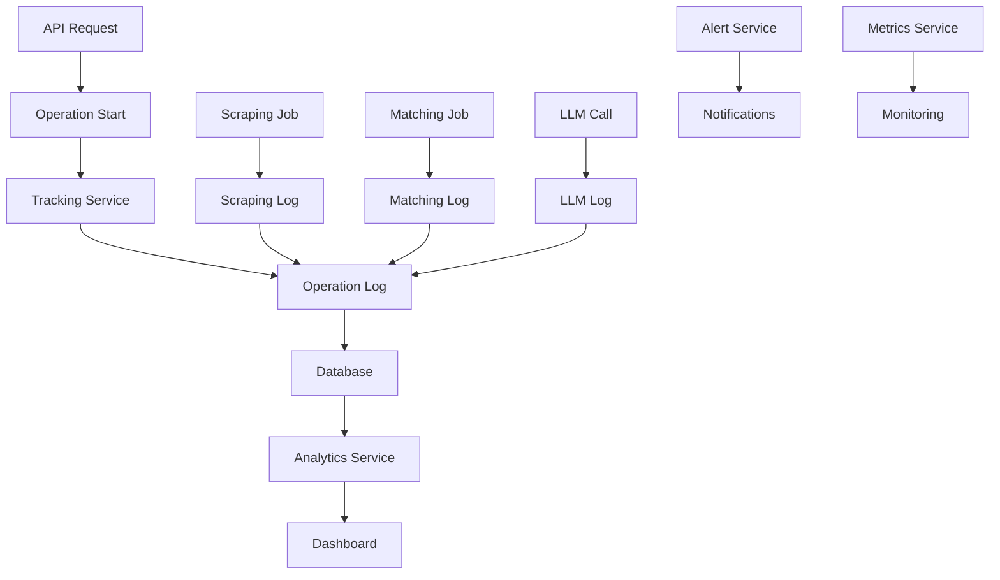

# Sistema de Tracking

O Home Buddy implementa um sistema abrangente de tracking para monitorar operações, performance e logs de todas as atividades do sistema, especialmente operações de scraping e matching.

## Visão Geral

- **Operações Rastreadas**: Scraping, Matching, LLM calls
- **Métricas**: Performance, custos, sucesso/falha
- **Logs Detalhados**: Input/output, erros, timing
- **Dashboard**: Interface para análise de dados
- **Alertas**: Notificações de falhas e anomalias

## Arquitetura do Sistema



## Modelos de Dados

### Operation Log

```typescript
// Entidade principal de tracking
interface OperationLog {
  id: number
  jobId: string // ID único da operação
  userId?: number // Usuário que iniciou
  operationType: OperationType // Tipo da operação
  status: OperationStatus // Status atual
  startTime: Date // Início da operação
  endTime?: Date // Fim da operação
  duration?: number // Duração em ms
  errorMessage?: string // Mensagem de erro
  metadata?: any // Dados adicionais
  createdAt: Date
  updatedAt: Date

  // Relacionamentos
  llmLogs: LLMLog[]
  matchingLog: MatchingLog?
  scrapingLog: ScrapingLog?
  user: User?
}

enum OperationType {
  SCRAPING_ONLY = 'SCRAPING_ONLY',
  SCRAPING_MATCHING = 'SCRAPING_MATCHING',
  MATCHING_ONLY = 'MATCHING_ONLY',
}

enum OperationStatus {
  RUNNING = 'RUNNING',
  COMPLETED = 'COMPLETED',
  FAILED = 'FAILED',
  CANCELLED = 'CANCELLED',
}
```

### Scraping Log

```typescript
interface ScrapingLog {
  id: number
  operationId: number // FK para OperationLog
  url: string // URL processada
  inputData: any // Dados de entrada
  outputData?: any // Dados extraídos
  httpStatus?: number // Status HTTP da resposta
  responseTime?: number // Tempo de resposta em ms
  errorDetails?: any // Detalhes do erro
  createdAt: Date
}
```

### Matching Log

```typescript
interface MatchingLog {
  id: number
  operationId: number // FK para OperationLog
  inputProducts: any // Produtos de entrada
  matcherRequest: any // Request para o matcher
  matcherResponse?: any // Response do matcher
  matchCount?: number // Número de matches
  unmatchCount?: number // Número de unmatches
  responseTime?: number // Tempo de resposta em ms
  errorDetails?: any // Detalhes do erro
  createdAt: Date
}
```

### LLM Log

```typescript
interface LLMLog {
  id: number
  operationId: number // FK para OperationLog
  provider: string // Provedor (openai, anthropic, etc.)
  model: string // Modelo usado
  prompt: string // Prompt enviado
  response?: string // Resposta recebida
  promptTokens?: number // Tokens do prompt
  responseTokens?: number // Tokens da resposta
  totalTokens?: number // Total de tokens
  cost?: number // Custo da operação
  temperature?: number // Temperatura usada
  responseTime?: number // Tempo de resposta em ms
  errorDetails?: any // Detalhes do erro
  createdAt: Date
}
```

## Tracking Service

### Implementação Base

```typescript
// tracking.service.ts
import { Injectable, Logger } from '@nestjs/common'
import { PrismaService } from '../prisma.service'

@Injectable()
export class TrackingService {
  private readonly logger = new Logger(TrackingService.name)

  constructor(private prisma: PrismaService) {}

  async startOperation(data: {
    jobId: string
    userId?: number
    operationType: OperationType
    metadata?: any
  }): Promise<OperationLog> {
    this.logger.log(
      `Iniciando operação ${data.jobId} do tipo ${data.operationType}`,
    )

    return await this.prisma.operationLog.create({
      data: {
        jobId: data.jobId,
        userId: data.userId,
        operationType: data.operationType,
        status: 'RUNNING',
        metadata: data.metadata,
      },
    })
  }

  async completeOperation(
    operationId: number,
    result?: any,
  ): Promise<OperationLog> {
    const operation = await this.prisma.operationLog.findUnique({
      where: { id: operationId },
    })

    if (!operation) {
      throw new Error(`Operação ${operationId} não encontrada`)
    }

    const duration = Date.now() - operation.startTime.getTime()

    this.logger.log(`Completando operação ${operation.jobId} em ${duration}ms`)

    return await this.prisma.operationLog.update({
      where: { id: operationId },
      data: {
        status: 'COMPLETED',
        endTime: new Date(),
        duration,
        metadata: { ...operation.metadata, result },
      },
    })
  }

  async failOperation(
    operationId: number,
    errorMessage: string,
    errorDetails?: any,
  ): Promise<OperationLog> {
    const operation = await this.prisma.operationLog.findUnique({
      where: { id: operationId },
    })

    if (!operation) {
      throw new Error(`Operação ${operationId} não encontrada`)
    }

    const duration = Date.now() - operation.startTime.getTime()

    this.logger.error(`Falha na operação ${operation.jobId}: ${errorMessage}`)

    return await this.prisma.operationLog.update({
      where: { id: operationId },
      data: {
        status: 'FAILED',
        endTime: new Date(),
        duration,
        errorMessage,
        metadata: { ...operation.metadata, errorDetails },
      },
    })
  }

  async cancelOperation(operationId: number): Promise<OperationLog> {
    const operation = await this.prisma.operationLog.findUnique({
      where: { id: operationId },
    })

    if (!operation) {
      throw new Error(`Operação ${operationId} não encontrada`)
    }

    const duration = Date.now() - operation.startTime.getTime()

    this.logger.log(`Cancelando operação ${operation.jobId}`)

    return await this.prisma.operationLog.update({
      where: { id: operationId },
      data: {
        status: 'CANCELLED',
        endTime: new Date(),
        duration,
      },
    })
  }
}
```

## Logging Específico

### Scraping Logging

```typescript
// scraping.service.ts
@Injectable()
export class ScrapingService {
  constructor(
    private prisma: PrismaService,
    private trackingService: TrackingService,
  ) {}

  async scrapeUrl(url: string, operationId: number): Promise<ScrapingResult> {
    const startTime = Date.now()

    try {
      // Criar log de scraping
      const scrapingLog = await this.prisma.scrapingLog.create({
        data: {
          operationId,
          url,
          inputData: { url, timestamp: new Date() },
        },
      })

      // Executar scraping
      const result = await this.performScraping(url)

      const responseTime = Date.now() - startTime

      // Atualizar log com resultado
      await this.prisma.scrapingLog.update({
        where: { id: scrapingLog.id },
        data: {
          outputData: result.data,
          httpStatus: result.status,
          responseTime,
        },
      })

      return result
    } catch (error) {
      const responseTime = Date.now() - startTime

      // Log de erro
      await this.prisma.scrapingLog.update({
        where: { operationId },
        data: {
          errorDetails: {
            message: error.message,
            stack: error.stack,
            timestamp: new Date(),
          },
          responseTime,
        },
      })

      throw error
    }
  }
}
```

### LLM Logging

```typescript
// llm.service.ts
@Injectable()
export class LLMService {
  constructor(
    private prisma: PrismaService,
    private trackingService: TrackingService,
  ) {}

  async callLLM(
    operationId: number,
    prompt: string,
    options: LLMOptions,
  ): Promise<LLMResponse> {
    const startTime = Date.now()

    try {
      // Criar log de LLM
      const llmLog = await this.prisma.lLMLog.create({
        data: {
          operationId,
          provider: options.provider || 'openai',
          model: options.model,
          prompt,
          temperature: options.temperature,
        },
      })

      // Fazer chamada para LLM
      const response = await this.callOpenAI(prompt, options)

      const responseTime = Date.now() - startTime

      // Atualizar log com resposta
      await this.prisma.lLMLog.update({
        where: { id: llmLog.id },
        data: {
          response: response.content,
          promptTokens: response.usage.prompt_tokens,
          responseTokens: response.usage.completion_tokens,
          totalTokens: response.usage.total_tokens,
          cost: this.calculateCost(response.usage, options.model),
          responseTime,
        },
      })

      return response
    } catch (error) {
      const responseTime = Date.now() - startTime

      // Log de erro
      await this.prisma.lLMLog.update({
        where: { operationId },
        data: {
          errorDetails: {
            message: error.message,
            stack: error.stack,
            timestamp: new Date(),
          },
          responseTime,
        },
      })

      throw error
    }
  }

  private calculateCost(usage: any, model: string): number {
    // Calcular custo baseado no modelo e tokens
    const pricing = {
      'gpt-4': { input: 0.03, output: 0.06 },
      'gpt-3.5-turbo': { input: 0.001, output: 0.002 },
    }

    const modelPricing = pricing[model] || pricing['gpt-3.5-turbo']

    return (
      (usage.prompt_tokens / 1000) * modelPricing.input +
      (usage.completion_tokens / 1000) * modelPricing.output
    )
  }
}
```

## Analytics Service

### Estatísticas Gerais

```typescript
// analytics.service.ts
@Injectable()
export class AnalyticsService {
  constructor(private prisma: PrismaService) {}

  async getStats(startDate?: Date, endDate?: Date): Promise<OperationStats> {
    const whereClause = this.buildDateFilter(startDate, endDate)

    const [
      totalOperations,
      completedOperations,
      failedOperations,
      averageDuration,
      totalCost,
    ] = await Promise.all([
      this.prisma.operationLog.count({ where: whereClause }),
      this.prisma.operationLog.count({
        where: { ...whereClause, status: 'COMPLETED' },
      }),
      this.prisma.operationLog.count({
        where: { ...whereClause, status: 'FAILED' },
      }),
      this.getAverageDuration(whereClause),
      this.getTotalCost(whereClause),
    ])

    return {
      totalOperations,
      completedOperations,
      failedOperations,
      successRate:
        totalOperations > 0 ? (completedOperations / totalOperations) * 100 : 0,
      averageDuration,
      totalCost,
    }
  }

  async getOperationsByUser(
    userId: number,
    limit = 10,
  ): Promise<OperationLog[]> {
    return await this.prisma.operationLog.findMany({
      where: { userId },
      include: {
        llmLogs: true,
        matchingLog: true,
        scrapingLog: true,
      },
      orderBy: { createdAt: 'desc' },
      take: limit,
    })
  }

  async getFailedOperations(limit = 10): Promise<OperationLog[]> {
    return await this.prisma.operationLog.findMany({
      where: { status: 'FAILED' },
      include: {
        llmLogs: true,
        matchingLog: true,
        scrapingLog: true,
        user: true,
      },
      orderBy: { createdAt: 'desc' },
      take: limit,
    })
  }

  async getCostByPeriod(startDate: Date, endDate: Date): Promise<CostAnalysis> {
    const llmLogs = await this.prisma.lLMLog.findMany({
      where: {
        createdAt: { gte: startDate, lte: endDate },
        cost: { not: null },
      },
      include: { operation: true },
    })

    const totalCost = llmLogs.reduce((sum, log) => sum + (log.cost || 0), 0)
    const costByProvider = this.groupByProvider(llmLogs)
    const costByModel = this.groupByModel(llmLogs)

    return {
      totalCost,
      costByProvider,
      costByModel,
      averageCostPerOperation:
        llmLogs.length > 0 ? totalCost / llmLogs.length : 0,
    }
  }

  private async getAverageDuration(whereClause: any): Promise<number> {
    const result = await this.prisma.operationLog.aggregate({
      where: { ...whereClause, duration: { not: null } },
      _avg: { duration: true },
    })

    return result._avg.duration || 0
  }

  private async getTotalCost(whereClause: any): Promise<number> {
    const result = await this.prisma.lLMLog.aggregate({
      where: {
        operation: whereClause,
        cost: { not: null },
      },
      _sum: { cost: true },
    })

    return result._sum.cost || 0
  }

  private buildDateFilter(startDate?: Date, endDate?: Date): any {
    const filter: any = {}

    if (startDate || endDate) {
      filter.createdAt = {}
      if (startDate) filter.createdAt.gte = startDate
      if (endDate) filter.createdAt.lte = endDate
    }

    return filter
  }

  private groupByProvider(logs: LLMLog[]): Record<string, number> {
    return logs.reduce(
      (acc, log) => {
        acc[log.provider] = (acc[log.provider] || 0) + (log.cost || 0)
        return acc
      },
      {} as Record<string, number>,
    )
  }

  private groupByModel(logs: LLMLog[]): Record<string, number> {
    return logs.reduce(
      (acc, log) => {
        acc[log.model] = (acc[log.model] || 0) + (log.cost || 0)
        return acc
      },
      {} as Record<string, number>,
    )
  }
}
```

## Tracking Controller

### Endpoints de API

```typescript
// tracking.controller.ts
@Controller('tracking')
@UseGuards(JwtAuthGuard)
export class TrackingController {
  constructor(private analyticsService: AnalyticsService) {}

  @Get('stats')
  async getStats(
    @Query('startDate') startDate?: string,
    @Query('endDate') endDate?: string,
  ) {
    const start = startDate ? new Date(startDate) : undefined
    const end = endDate ? new Date(endDate) : undefined

    return await this.analyticsService.getStats(start, end)
  }

  @Get('operations')
  async getOperations(
    @Query('userId') userId?: number,
    @Query('limit') limit = 10,
  ) {
    if (userId) {
      return await this.analyticsService.getOperationsByUser(userId, limit)
    }

    return await this.analyticsService.getFailedOperations(limit)
  }

  @Get('failed-operations')
  async getFailedOperations(@Query('limit') limit = 10) {
    return await this.analyticsService.getFailedOperations(limit)
  }

  @Get('cost-analysis')
  async getCostAnalysis(
    @Query('startDate') startDate: string,
    @Query('endDate') endDate: string,
  ) {
    const start = new Date(startDate)
    const end = new Date(endDate)

    return await this.analyticsService.getCostByPeriod(start, end)
  }

  @Get('performance-metrics')
  async getPerformanceMetrics() {
    return await this.analyticsService.getPerformanceMetrics()
  }
}
```

## Dashboard e Visualizações

### Métricas Principais

```typescript
// dashboard.service.ts
@Injectable()
export class DashboardService {
  constructor(private analyticsService: AnalyticsService) {}

  async getDashboardData(): Promise<DashboardData> {
    const [stats, recentOperations, costAnalysis, performanceMetrics] =
      await Promise.all([
        this.analyticsService.getStats(),
        this.analyticsService.getOperationsByUser(undefined, 5),
        this.analyticsService.getCostByPeriod(
          new Date(Date.now() - 30 * 24 * 60 * 60 * 1000), // 30 dias atrás
          new Date(),
        ),
        this.analyticsService.getPerformanceMetrics(),
      ])

    return {
      stats,
      recentOperations,
      costAnalysis,
      performanceMetrics,
      charts: await this.generateCharts(),
    }
  }

  private async generateCharts(): Promise<ChartData[]> {
    // Gerar dados para gráficos
    const operationsOverTime = await this.getOperationsOverTime()
    const costOverTime = await this.getCostOverTime()
    const successRateOverTime = await this.getSuccessRateOverTime()

    return [
      {
        type: 'line',
        title: 'Operações ao Longo do Tempo',
        data: operationsOverTime,
      },
      {
        type: 'bar',
        title: 'Custo por Período',
        data: costOverTime,
      },
      {
        type: 'line',
        title: 'Taxa de Sucesso',
        data: successRateOverTime,
      },
    ]
  }
}
```

## Alertas e Notificações

### Sistema de Alertas

```typescript
// alert.service.ts
@Injectable()
export class AlertService {
  constructor(
    private prisma: PrismaService,
    private emailService: EmailService,
  ) {}

  async checkAlerts(): Promise<void> {
    await Promise.all([
      this.checkFailureRate(),
      this.checkHighCost(),
      this.checkSlowOperations(),
      this.checkQueueBacklog(),
    ])
  }

  private async checkFailureRate(): Promise<void> {
    const last24Hours = new Date(Date.now() - 24 * 60 * 60 * 1000)

    const stats = await this.prisma.operationLog.aggregate({
      where: {
        createdAt: { gte: last24Hours },
      },
      _count: { id: true },
    })

    const failedCount = await this.prisma.operationLog.count({
      where: {
        createdAt: { gte: last24Hours },
        status: 'FAILED',
      },
    })

    const failureRate = (failedCount / stats._count.id) * 100

    if (failureRate > 10) {
      // Alerta se taxa de falha > 10%
      await this.sendAlert({
        type: 'HIGH_FAILURE_RATE',
        message: `Taxa de falha alta: ${failureRate.toFixed(2)}%`,
        data: { failureRate, totalOperations: stats._count.id },
      })
    }
  }

  private async checkHighCost(): Promise<void> {
    const last24Hours = new Date(Date.now() - 24 * 60 * 60 * 1000)

    const totalCost = await this.prisma.lLMLog.aggregate({
      where: {
        createdAt: { gte: last24Hours },
        cost: { not: null },
      },
      _sum: { cost: true },
    })

    if (totalCost._sum.cost && totalCost._sum.cost > 100) {
      // Alerta se custo > $100
      await this.sendAlert({
        type: 'HIGH_COST',
        message: `Custo alto nas últimas 24h: $${totalCost._sum.cost.toFixed(2)}`,
        data: { cost: totalCost._sum.cost },
      })
    }
  }

  private async sendAlert(alert: Alert): Promise<void> {
    // Salvar alerta no banco
    await this.prisma.alert.create({
      data: {
        type: alert.type,
        message: alert.message,
        data: alert.data,
        sentAt: new Date(),
      },
    })

    // Enviar email (se configurado)
    if (process.env.ALERT_EMAIL) {
      await this.emailService.sendAlert(alert)
    }

    // Log do alerta
    console.log(`ALERT: ${alert.type} - ${alert.message}`)
  }
}
```

## Configuração de Ambiente

### Variáveis Necessárias

```env
# Tracking Configuration
TRACKING_ENABLED=true
TRACKING_RETENTION_DAYS=90

# Alert Configuration
ALERT_EMAIL=admin@homebuddy.com
ALERT_FAILURE_RATE_THRESHOLD=10
ALERT_COST_THRESHOLD=100

# Performance Monitoring
PERFORMANCE_MONITORING_ENABLED=true
SLOW_OPERATION_THRESHOLD=30000
```

## Limpeza e Manutenção

### Limpeza Automática

```typescript
// cleanup.service.ts
@Injectable()
export class CleanupService {
  constructor(private prisma: PrismaService) {}

  @Cron('0 2 * * *') // Executar diariamente às 2h
  async cleanupOldLogs(): Promise<void> {
    const retentionDays = parseInt(process.env.TRACKING_RETENTION_DAYS || '90')
    const cutoffDate = new Date(
      Date.now() - retentionDays * 24 * 60 * 60 * 1000,
    )

    // Limpar logs antigos
    const deletedLogs = await this.prisma.operationLog.deleteMany({
      where: {
        createdAt: { lt: cutoffDate },
        status: { in: ['COMPLETED', 'FAILED'] },
      },
    })

    console.log(`Limpeza concluída: ${deletedLogs.count} logs removidos`)
  }

  @Cron('0 3 * * 0') // Executar semanalmente
  async optimizeDatabase(): Promise<void> {
    // Otimizar índices e estatísticas
    await this.prisma.$executeRaw`VACUUM ANALYZE`
    console.log('Otimização do banco concluída')
  }
}
```
