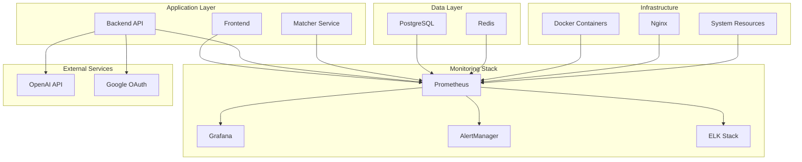

# Monitoramento e Observabilidade

Guia completo para monitoramento do Home Buddy em produção, incluindo métricas, logs, alertas e dashboards para garantir a saúde e performance do sistema.

## Visão Geral

O sistema de monitoramento do Home Buddy fornece visibilidade completa sobre a saúde, performance e comportamento da aplicação em tempo real.

## Arquitetura de Monitoramento



## Stack de Monitoramento

### Componentes Principais

| Componente        | Função                   | Porta | Descrição            |
| ----------------- | ------------------------ | ----- | -------------------- |
| **Prometheus**    | Coleta de métricas       | 9090  | Time-series database |
| **Grafana**       | Visualização             | 3000  | Dashboards e alertas |
| **AlertManager**  | Gerenciamento de alertas | 9093  | Notificações         |
| **Elasticsearch** | Log storage              | 9200  | Search engine        |
| **Logstash**      | Log processing           | 5044  | Data processing      |
| **Kibana**        | Log visualization        | 5601  | Log analysis         |

## Métricas do Sistema

### Métricas de Aplicação

#### Backend (NestJS)

```typescript
// Métricas customizadas
import { Counter, Histogram, Gauge } from 'prom-client'

// Contadores
const httpRequestsTotal = new Counter({
  name: 'http_requests_total',
  help: 'Total number of HTTP requests',
  labelNames: ['method', 'route', 'status_code'],
})

const scrapingJobsTotal = new Counter({
  name: 'scraping_jobs_total',
  help: 'Total number of scraping jobs',
  labelNames: ['status', 'user_id'],
})

// Histogramas
const httpRequestDuration = new Histogram({
  name: 'http_request_duration_seconds',
  help: 'Duration of HTTP requests in seconds',
  labelNames: ['method', 'route'],
  buckets: [0.1, 0.3, 0.5, 0.7, 1, 3, 5, 7, 10],
})

const openaiApiDuration = new Histogram({
  name: 'openai_api_duration_seconds',
  help: 'Duration of OpenAI API calls',
  labelNames: ['model', 'operation'],
  buckets: [0.5, 1, 2, 5, 10, 30, 60],
})

// Gauges
const activeUsers = new Gauge({
  name: 'active_users_total',
  help: 'Number of active users',
  labelNames: ['timeframe'],
})

const queueSize = new Gauge({
  name: 'queue_size_total',
  help: 'Current queue size',
  labelNames: ['queue_name'],
})
```

#### Frontend (Next.js)

```typescript
// Métricas do frontend
export const trackPageView = (page: string) => {
  // Enviar para analytics
  gtag('event', 'page_view', {
    page_title: page,
    page_location: window.location.href,
  })
}

export const trackUserAction = (action: string, category: string) => {
  gtag('event', action, {
    event_category: category,
    event_label: action,
  })
}

export const trackPerformance = () => {
  // Core Web Vitals
  if ('web-vital' in window) {
    getCLS(trackCLS)
    getFID(trackFID)
    getFCP(trackFCP)
    getLCP(trackLCP)
    getTTFB(trackTTFB)
  }
}
```

#### Matcher (FastAPI)

```python
# Métricas do matcher
from prometheus_client import Counter, Histogram, Gauge

# Contadores
match_requests_total = Counter(
    'match_requests_total',
    'Total number of match requests',
    ['user_id', 'status']
)

openai_tokens_total = Counter(
    'openai_tokens_total',
    'Total OpenAI tokens used',
    ['model', 'type']
)

# Histogramas
match_duration_seconds = Histogram(
    'match_duration_seconds',
    'Duration of match operations',
    ['user_id'],
    buckets=[0.5, 1, 2, 5, 10, 30, 60]
)

openai_cost_usd = Histogram(
    'openai_cost_usd',
    'OpenAI API cost in USD',
    ['model'],
    buckets=[0.001, 0.005, 0.01, 0.05, 0.1, 0.5, 1.0]
)

# Gauges
active_matches = Gauge(
    'active_matches_total',
    'Number of active match operations'
)
```

### Métricas de Infraestrutura

#### Docker Containers

```yaml
# docker-compose.monitoring.yml
version: '3.8'

services:
  prometheus:
    image: prom/prometheus:latest
    ports:
      - '9090:9090'
    volumes:
      - ./prometheus.yml:/etc/prometheus/prometheus.yml
      - prometheus_data:/prometheus
    command:
      - '--config.file=/etc/prometheus/prometheus.yml'
      - '--storage.tsdb.path=/prometheus'
      - '--web.console.libraries=/etc/prometheus/console_libraries'
      - '--web.console.templates=/etc/prometheus/consoles'
      - '--storage.tsdb.retention.time=200h'
      - '--web.enable-lifecycle'

  grafana:
    image: grafana/grafana:latest
    ports:
      - '3001:3000'
    environment:
      - GF_SECURITY_ADMIN_PASSWORD=admin
    volumes:
      - grafana_data:/var/lib/grafana
      - ./grafana/provisioning:/etc/grafana/provisioning

  node-exporter:
    image: prom/node-exporter:latest
    ports:
      - '9100:9100'
    volumes:
      - /proc:/host/proc:ro
      - /sys:/host/sys:ro
      - /:/rootfs:ro
    command:
      - '--path.procfs=/host/proc'
      - '--path.rootfs=/rootfs'
      - '--path.sysfs=/host/sys'
      - '--collector.filesystem.mount-points-exclude=^/(sys|proc|dev|host|etc)($$|/)'

volumes:
  prometheus_data:
  grafana_data:
```

#### PostgreSQL

```sql
-- Métricas customizadas do PostgreSQL
CREATE EXTENSION IF NOT EXISTS pg_stat_statements;

-- Query para métricas de performance
SELECT
    schemaname,
    tablename,
    attname,
    n_distinct,
    correlation
FROM pg_stats
WHERE schemaname = 'public';

-- Query para métricas de conexões
SELECT
    count(*) as total_connections,
    count(*) FILTER (WHERE state = 'active') as active_connections,
    count(*) FILTER (WHERE state = 'idle') as idle_connections
FROM pg_stat_activity;
```

#### Redis

```bash
# Métricas do Redis
redis-cli info stats
redis-cli info memory
redis-cli info clients
redis-cli info replication
```

## Configuração do Prometheus

### prometheus.yml

```yaml
global:
  scrape_interval: 15s
  evaluation_interval: 15s

rule_files:
  - 'alert_rules.yml'

alerting:
  alertmanagers:
    - static_configs:
        - targets:
            - alertmanager:9093

scrape_configs:
  # Prometheus self-monitoring
  - job_name: 'prometheus'
    static_configs:
      - targets: ['localhost:9090']

  # Node Exporter
  - job_name: 'node-exporter'
    static_configs:
      - targets: ['node-exporter:9100']

  # Backend API
  - job_name: 'backend-api'
    static_configs:
      - targets: ['backend:3000']
    metrics_path: '/metrics'
    scrape_interval: 10s

  # Matcher Service
  - job_name: 'matcher-service'
    static_configs:
      - targets: ['matcher:8000']
    metrics_path: '/metrics'
    scrape_interval: 10s

  # PostgreSQL
  - job_name: 'postgres'
    static_configs:
      - targets: ['postgres-exporter:9187']

  # Redis
  - job_name: 'redis'
    static_configs:
      - targets: ['redis-exporter:9121']

  # Nginx
  - job_name: 'nginx'
    static_configs:
      - targets: ['nginx-exporter:9113']
```

### Alert Rules

```yaml
# alert_rules.yml
groups:
  - name: home-buddy-alerts
    rules:
      # High error rate
      - alert: HighErrorRate
        expr: rate(http_requests_total{status=~"5.."}[5m]) > 0.1
        for: 2m
        labels:
          severity: critical
        annotations:
          summary: 'High error rate detected'
          description: 'Error rate is {{ $value }} errors per second'

      # High response time
      - alert: HighResponseTime
        expr: histogram_quantile(0.95, rate(http_request_duration_seconds_bucket[5m])) > 2
        for: 5m
        labels:
          severity: warning
        annotations:
          summary: 'High response time'
          description: '95th percentile response time is {{ $value }}s'

      # Database connection issues
      - alert: DatabaseDown
        expr: up{job="postgres"} == 0
        for: 1m
        labels:
          severity: critical
        annotations:
          summary: 'PostgreSQL is down'
          description: 'PostgreSQL database is not responding'

      # Redis connection issues
      - alert: RedisDown
        expr: up{job="redis"} == 0
        for: 1m
        labels:
          severity: critical
        annotations:
          summary: 'Redis is down'
          description: 'Redis cache is not responding'

      # High memory usage
      - alert: HighMemoryUsage
        expr: (node_memory_MemTotal_bytes - node_memory_MemAvailable_bytes) / node_memory_MemTotal_bytes > 0.9
        for: 5m
        labels:
          severity: warning
        annotations:
          summary: 'High memory usage'
          description: 'Memory usage is {{ $value | humanizePercentage }}'

      # High CPU usage
      - alert: HighCPUUsage
        expr: 100 - (avg by(instance) (rate(node_cpu_seconds_total{mode="idle"}[5m])) * 100) > 80
        for: 5m
        labels:
          severity: warning
        annotations:
          summary: 'High CPU usage'
          description: 'CPU usage is {{ $value }}%'

      # Disk space low
      - alert: LowDiskSpace
        expr: (node_filesystem_avail_bytes{mountpoint="/"} / node_filesystem_size_bytes{mountpoint="/"}) < 0.1
        for: 5m
        labels:
          severity: critical
        annotations:
          summary: 'Low disk space'
          description: 'Disk space is {{ $value | humanizePercentage }}'

      # OpenAI API errors
      - alert: OpenAIApiErrors
        expr: rate(openai_api_errors_total[5m]) > 0.05
        for: 2m
        labels:
          severity: warning
        annotations:
          summary: 'OpenAI API errors'
          description: 'OpenAI API error rate is {{ $value }} errors per second'

      # Queue backlog
      - alert: QueueBacklog
        expr: queue_size_total > 100
        for: 5m
        labels:
          severity: warning
        annotations:
          summary: 'Queue backlog'
          description: 'Queue {{ $labels.queue_name }} has {{ $value }} pending jobs'
```

## Dashboards do Grafana

### Dashboard Principal

```json
{
  "dashboard": {
    "title": "Home Buddy - Overview",
    "panels": [
      {
        "title": "Request Rate",
        "type": "graph",
        "targets": [
          {
            "expr": "rate(http_requests_total[5m])",
            "legendFormat": "{{method}} {{route}}"
          }
        ]
      },
      {
        "title": "Response Time",
        "type": "graph",
        "targets": [
          {
            "expr": "histogram_quantile(0.50, rate(http_request_duration_seconds_bucket[5m]))",
            "legendFormat": "50th percentile"
          },
          {
            "expr": "histogram_quantile(0.95, rate(http_request_duration_seconds_bucket[5m]))",
            "legendFormat": "95th percentile"
          },
          {
            "expr": "histogram_quantile(0.99, rate(http_request_duration_seconds_bucket[5m]))",
            "legendFormat": "99th percentile"
          }
        ]
      },
      {
        "title": "Error Rate",
        "type": "graph",
        "targets": [
          {
            "expr": "rate(http_requests_total{status=~\"5..\"}[5m])",
            "legendFormat": "5xx errors"
          },
          {
            "expr": "rate(http_requests_total{status=~\"4..\"}[5m])",
            "legendFormat": "4xx errors"
          }
        ]
      },
      {
        "title": "Active Users",
        "type": "singlestat",
        "targets": [
          {
            "expr": "active_users_total",
            "legendFormat": "Active Users"
          }
        ]
      },
      {
        "title": "System Resources",
        "type": "graph",
        "targets": [
          {
            "expr": "100 - (avg by(instance) (rate(node_cpu_seconds_total{mode=\"idle\"}[5m])) * 100)",
            "legendFormat": "CPU Usage %"
          },
          {
            "expr": "(node_memory_MemTotal_bytes - node_memory_MemAvailable_bytes) / node_memory_MemTotal_bytes * 100",
            "legendFormat": "Memory Usage %"
          }
        ]
      }
    ]
  }
}
```

### Dashboard de Performance

```json
{
  "dashboard": {
    "title": "Home Buddy - Performance",
    "panels": [
      {
        "title": "API Endpoints Performance",
        "type": "table",
        "targets": [
          {
            "expr": "topk(10, rate(http_request_duration_seconds_sum[5m]) / rate(http_request_duration_seconds_count[5m]))",
            "format": "table"
          }
        ]
      },
      {
        "title": "Database Performance",
        "type": "graph",
        "targets": [
          {
            "expr": "rate(pg_stat_database_tup_returned[5m])",
            "legendFormat": "Tuples Returned"
          },
          {
            "expr": "rate(pg_stat_database_tup_fetched[5m])",
            "legendFormat": "Tuples Fetched"
          }
        ]
      },
      {
        "title": "Redis Performance",
        "type": "graph",
        "targets": [
          {
            "expr": "rate(redis_commands_processed_total[5m])",
            "legendFormat": "Commands/sec"
          },
          {
            "expr": "redis_memory_used_bytes",
            "legendFormat": "Memory Used"
          }
        ]
      }
    ]
  }
}
```

## Logs e Análise

### Configuração do ELK Stack

```yaml
# docker-compose.logging.yml
version: '3.8'

services:
  elasticsearch:
    image: docker.elastic.co/elasticsearch/elasticsearch:7.15.0
    environment:
      - discovery.type=single-node
      - 'ES_JAVA_OPTS=-Xms512m -Xmx512m'
    ports:
      - '9200:9200'
    volumes:
      - elasticsearch_data:/usr/share/elasticsearch/data

  logstash:
    image: docker.elastic.co/logstash/logstash:7.15.0
    ports:
      - '5044:5044'
    volumes:
      - ./logstash.conf:/usr/share/logstash/pipeline/logstash.conf
    depends_on:
      - elasticsearch

  kibana:
    image: docker.elastic.co/kibana/kibana:7.15.0
    ports:
      - '5601:5601'
    environment:
      - ELASTICSEARCH_HOSTS=http://elasticsearch:9200
    depends_on:
      - elasticsearch

volumes:
  elasticsearch_data:
```

### Configuração do Logstash

```ruby
# logstash.conf
input {
  beats {
    port => 5044
  }
}

filter {
  if [fields][service] == "backend" {
    grok {
      match => { "message" => "%{TIMESTAMP_ISO8601:timestamp} %{LOGLEVEL:level} %{DATA:logger} %{GREEDYDATA:message}" }
    }

    if [level] == "ERROR" {
      mutate {
        add_tag => [ "error" ]
      }
    }
  }

  if [fields][service] == "frontend" {
    grok {
      match => { "message" => "%{TIMESTAMP_ISO8601:timestamp} %{LOGLEVEL:level} %{DATA:logger} %{GREEDYDATA:message}" }
    }
  }
}

output {
  elasticsearch {
    hosts => ["elasticsearch:9200"]
    index => "home-buddy-%{+YYYY.MM.dd}"
  }
}
```

### Estrutura de Logs

#### Backend Logs

```typescript
// Estrutura de log do backend
interface LogEntry {
  timestamp: string
  level: 'DEBUG' | 'INFO' | 'WARN' | 'ERROR'
  logger: string
  message: string
  context?: {
    userId?: string
    requestId?: string
    operation?: string
    duration?: number
    error?: {
      name: string
      message: string
      stack?: string
    }
  }
  metadata?: Record<string, any>
}
```

#### Frontend Logs

```typescript
// Estrutura de log do frontend
interface FrontendLogEntry {
  timestamp: string
  level: 'DEBUG' | 'INFO' | 'WARN' | 'ERROR'
  component: string
  action: string
  message: string
  context?: {
    userId?: string
    sessionId?: string
    userAgent?: string
    url?: string
    error?: {
      name: string
      message: string
      stack?: string
    }
  }
}
```

## Alertas e Notificações

### Configuração do AlertManager

```yaml
# alertmanager.yml
global:
  smtp_smarthost: 'localhost:587'
  smtp_from: 'alerts@homebuddy.com'

route:
  group_by: ['alertname']
  group_wait: 10s
  group_interval: 10s
  repeat_interval: 1h
  receiver: 'web.hook'

receivers:
  - name: 'web.hook'
    webhook_configs:
      - url: 'http://webhook:5001/'

  - name: 'email'
    email_configs:
      - to: 'admin@homebuddy.com'
        subject: 'Home Buddy Alert: {{ .GroupLabels.alertname }}'
        body: |
          {{ range .Alerts }}
          Alert: {{ .Annotations.summary }}
          Description: {{ .Annotations.description }}
          {{ end }}

  - name: 'slack'
    slack_configs:
      - api_url: 'https://hooks.slack.com/services/YOUR/SLACK/WEBHOOK'
        channel: '#alerts'
        title: 'Home Buddy Alert'
        text: |
          {{ range .Alerts }}
          *{{ .Annotations.summary }}*
          {{ .Annotations.description }}
          {{ end }}
```

### Webhook para Alertas

```python
# webhook.py
from flask import Flask, request, jsonify
import requests

app = Flask(__name__)

@app.route('/webhook', methods=['POST'])
def webhook():
    data = request.json

    for alert in data.get('alerts', []):
        if alert['status'] == 'firing':
            # Enviar para Slack
            send_slack_alert(alert)

            # Enviar para Discord
            send_discord_alert(alert)

            # Enviar SMS (se crítico)
            if alert['labels'].get('severity') == 'critical':
                send_sms_alert(alert)

    return jsonify({'status': 'success'})

def send_slack_alert(alert):
    webhook_url = "https://hooks.slack.com/services/YOUR/SLACK/WEBHOOK"
    message = {
        "text": f"🚨 {alert['annotations']['summary']}",
        "attachments": [
            {
                "color": "danger" if alert['labels'].get('severity') == 'critical' else "warning",
                "fields": [
                    {
                        "title": "Description",
                        "value": alert['annotations']['description'],
                        "short": False
                    }
                ]
            }
        ]
    }

    requests.post(webhook_url, json=message)

if __name__ == '__main__':
    app.run(host='0.0.0.0', port=5001)
```

## Health Checks

### Endpoints de Health Check

#### Backend

```typescript
// health.controller.ts
@Controller('health')
export class HealthController {
  constructor(
    private prisma: PrismaService,
    private redis: RedisService,
  ) {}

  @Get()
  async checkHealth() {
    const checks = await Promise.allSettled([
      this.checkDatabase(),
      this.checkRedis(),
      this.checkExternalServices(),
    ])

    const results = checks.map((check, index) => ({
      service: ['database', 'redis', 'external'][index],
      status: check.status === 'fulfilled' ? 'healthy' : 'unhealthy',
      details: check.status === 'fulfilled' ? check.value : check.reason,
    }))

    const overallStatus = results.every((r) => r.status === 'healthy')
      ? 'healthy'
      : 'unhealthy'

    return {
      status: overallStatus,
      timestamp: new Date().toISOString(),
      checks: results,
    }
  }

  private async checkDatabase() {
    try {
      await this.prisma.$queryRaw`SELECT 1`
      return { status: 'healthy', responseTime: '< 10ms' }
    } catch (error) {
      throw new Error(`Database check failed: ${error.message}`)
    }
  }

  private async checkRedis() {
    try {
      await this.redis.ping()
      return { status: 'healthy', responseTime: '< 5ms' }
    } catch (error) {
      throw new Error(`Redis check failed: ${error.message}`)
    }
  }

  private async checkExternalServices() {
    // Verificar OpenAI API
    try {
      const response = await fetch('https://api.openai.com/v1/models', {
        headers: { Authorization: `Bearer ${process.env.OPENAI_API_KEY}` },
      })

      if (!response.ok) {
        throw new Error(`OpenAI API returned ${response.status}`)
      }

      return {
        status: 'healthy',
        openai: 'available',
        responseTime: '< 100ms',
      }
    } catch (error) {
      throw new Error(`External services check failed: ${error.message}`)
    }
  }
}
```

#### Frontend

```typescript
// pages/api/health.ts
export default async function handler(
  req: NextApiRequest,
  res: NextApiResponse,
) {
  try {
    // Verificar conectividade com API
    const apiResponse = await fetch(`${process.env.API_BASE_URL}/health`)

    if (!apiResponse.ok) {
      throw new Error('API health check failed')
    }

    const apiHealth = await apiResponse.json()

    res.status(200).json({
      status: 'healthy',
      timestamp: new Date().toISOString(),
      frontend: {
        status: 'healthy',
        version: process.env.npm_package_version,
      },
      api: apiHealth,
    })
  } catch (error) {
    res.status(503).json({
      status: 'unhealthy',
      timestamp: new Date().toISOString(),
      error: error.message,
    })
  }
}
```

## Métricas de Negócio

### KPIs Importantes

```typescript
// Métricas de negócio
export const businessMetrics = {
  // Usuários
  totalUsers: new Gauge({
    name: 'total_users',
    help: 'Total number of registered users',
  }),

  activeUsers: new Gauge({
    name: 'active_users_daily',
    help: 'Number of active users in the last 24 hours',
  }),

  // Produtos
  totalProducts: new Gauge({
    name: 'total_products',
    help: 'Total number of products in the system',
  }),

  productsPerUser: new Histogram({
    name: 'products_per_user',
    help: 'Number of products per user',
    buckets: [1, 5, 10, 25, 50, 100],
  }),

  // Scraping
  scrapingSuccessRate: new Gauge({
    name: 'scraping_success_rate',
    help: 'Success rate of scraping operations',
  }),

  averageScrapingTime: new Histogram({
    name: 'scraping_duration_seconds',
    help: 'Duration of scraping operations',
    buckets: [1, 5, 10, 30, 60, 120, 300],
  }),

  // Matching
  matchingAccuracy: new Gauge({
    name: 'matching_accuracy',
    help: 'Accuracy of product matching',
  }),

  averageMatchingTime: new Histogram({
    name: 'matching_duration_seconds',
    help: 'Duration of matching operations',
    buckets: [0.5, 1, 2, 5, 10, 30],
  }),

  // Custos
  openaiCostDaily: new Gauge({
    name: 'openai_cost_daily_usd',
    help: 'Daily OpenAI API cost in USD',
  }),

  openaiTokensDaily: new Counter({
    name: 'openai_tokens_daily_total',
    help: 'Daily OpenAI tokens usage',
  }),
}
```

## Relatórios Automatizados

### Relatório Diário

```python
# daily_report.py
import requests
import json
from datetime import datetime, timedelta

def generate_daily_report():
    # Buscar métricas do Prometheus
    prometheus_url = "http://prometheus:9090/api/v1/query"

    # Métricas do dia anterior
    end_time = datetime.now()
    start_time = end_time - timedelta(days=1)

    queries = {
        'total_requests': 'sum(increase(http_requests_total[1d]))',
        'error_rate': 'sum(rate(http_requests_total{status=~"5.."}[1d]))',
        'avg_response_time': 'avg(rate(http_request_duration_seconds_sum[1d]) / rate(http_request_duration_seconds_count[1d]))',
        'active_users': 'max(active_users_total)',
        'openai_cost': 'sum(increase(openai_cost_usd[1d]))',
        'scraping_jobs': 'sum(increase(scraping_jobs_total[1d]))'
    }

    metrics = {}
    for name, query in queries.items():
        response = requests.get(prometheus_url, params={'query': query})
        if response.status_code == 200:
            data = response.json()
            if data['data']['result']:
                metrics[name] = float(data['data']['result'][0]['value'][1])

    # Gerar relatório
    report = f"""
    📊 Relatório Diário - Home Buddy
    Data: {start_time.strftime('%d/%m/%Y')}

    📈 Métricas Gerais:
    • Total de requisições: {metrics.get('total_requests', 0):,.0f}
    • Taxa de erro: {metrics.get('error_rate', 0):.2%}
    • Tempo médio de resposta: {metrics.get('avg_response_time', 0):.3f}s
    • Usuários ativos: {metrics.get('active_users', 0):,.0f}

    🤖 IA e Scraping:
    • Jobs de scraping: {metrics.get('scraping_jobs', 0):,.0f}
    • Custo OpenAI: ${metrics.get('openai_cost', 0):.2f}

    ✅ Status: Sistema funcionando normalmente
    """

    # Enviar para Slack
    send_slack_report(report)

    return report

def send_slack_report(report):
    webhook_url = "https://hooks.slack.com/services/YOUR/SLACK/WEBHOOK"
    message = {
        "text": "📊 Relatório Diário - Home Buddy",
        "blocks": [
            {
                "type": "section",
                "text": {
                    "type": "mrkdwn",
                    "text": report
                }
            }
        ]
    }

    requests.post(webhook_url, json=message)

if __name__ == "__main__":
    generate_daily_report()
```

## Troubleshooting

### Problemas Comuns

#### 1. Métricas não aparecem no Grafana

```bash
# Verificar se Prometheus está coletando
curl http://localhost:9090/api/v1/targets

# Verificar métricas específicas
curl "http://localhost:9090/api/v1/query?query=up"
```

#### 2. Alertas não funcionam

```bash
# Verificar configuração do AlertManager
curl http://localhost:9093/api/v1/alerts

# Verificar regras do Prometheus
curl http://localhost:9090/api/v1/rules
```

#### 3. Logs não aparecem no Kibana

```bash
# Verificar status do Elasticsearch
curl http://localhost:9200/_cluster/health

# Verificar índices
curl http://localhost:9200/_cat/indices
```

### Comandos Úteis

```bash
# Verificar métricas do sistema
curl http://localhost:9090/api/v1/query?query=node_cpu_seconds_total

# Verificar alertas ativos
curl http://localhost:9093/api/v1/alerts

# Verificar logs do Elasticsearch
curl http://localhost:9200/_search?q=*

# Verificar status dos containers
docker-compose ps
```

## Próximos Passos

### Melhorias Futuras

1. **APM**: Implementar Application Performance Monitoring
2. **Distributed Tracing**: Adicionar Jaeger para tracing distribuído
3. **Synthetic Monitoring**: Implementar testes sintéticos
4. **Machine Learning**: Anomaly detection com ML
5. **Custom Dashboards**: Dashboards específicos por usuário
6. **Mobile Monitoring**: Métricas para aplicativo mobile
7. **Cost Optimization**: Alertas de custo em tempo real
8. **SLA Monitoring**: Monitoramento de SLAs
