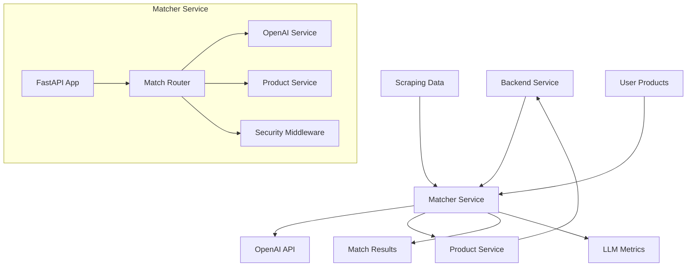

# Serviço Matcher

O Matcher é um serviço especializado em Python/FastAPI responsável por comparar produtos extraídos via scraping com os produtos cadastrados pelo usuário, utilizando inteligência artificial (OpenAI) para realizar a correspondência inteligente.

## Visão Geral

O Matcher Service é um microserviço independente que:

- **Recebe produtos extraídos** de notas fiscais via scraping
- **Consulta produtos cadastrados** pelo usuário no backend principal
- **Utiliza IA (OpenAI)** para fazer correspondência inteligente
- **Retorna matches e unmatches** com níveis de confiança
- **Fornece métricas detalhadas** de uso da LLM para tracking

## Arquitetura



## Tecnologias Utilizadas

### Core Framework

- **FastAPI**: Framework web moderno e rápido para APIs Python
- **Pydantic**: Validação de dados e serialização
- **Uvicorn**: Servidor ASGI para produção

### AI/ML

- **OpenAI API**: Integração com GPT-4o-mini para matching inteligente
- **JSON Mode**: Resposta estruturada garantida

### HTTP Client

- **httpx**: Cliente HTTP assíncrono para comunicação com backend

### Testing

- **pytest**: Framework de testes
- **pytest-asyncio**: Suporte a testes assíncronos

## Estrutura do Projeto

```
apps/matcher/
├── app/
│   ├── api/
│   │   └── routes/
│   │       └── match.py          # Rotas HTTP
│   ├── core/
│   │   └── config.py             # Configurações
│   ├── dependencies/
│   │   └── security.py           # Middleware de segurança
│   ├── schemas/
│   │   └── match.py              # Modelos Pydantic
│   ├── services/
│   │   ├── openai_service.py     # Integração OpenAI
│   │   └── product_service.py    # Comunicação com backend
│   └── main.py                   # Aplicação FastAPI
├── tests/                        # Testes unitários
├── Dockerfile                    # Containerização
├── requirements.txt              # Dependências Python
└── README.md                     # Documentação local
```

## Fluxo de Funcionamento

### 1. Recebimento da Requisição

```python
# Endpoint principal
@router.post("", response_model=MatchResponse)
async def match_products(payload: MatchRequest):
    # 1. Busca produtos do usuário no backend
    products_user = await fetch_user_products(payload.user_id)

    # 2. Monta prompt e chama LLM
    prompt = build_prompt(payload.products_scrap, products_user)
    result, llm_info = ask_openai(prompt)

    # 3. Retorna resultado com métricas
    return MatchResponse(
        match=result.get("match", []),
        unmatch=result.get("unmatch", []),
        llm_info=LLMInfo(**llm_info)
    )
```

### 2. Construção do Prompt

```python
def build_prompt(products_scrap: List[ProductScrap], products_user: List[Dict[str, Any]]) -> str:
    prompt = (
        "Você é um assistente que faz correspondência de produtos.\n"
        "Receberá duas listas em JSON:\n"
        "1) 'produtos_scrap' - itens extraídos de uma nota fiscal.\n"
        "2) 'produtos_usuario' - itens já cadastrados pelo usuário.\n"
        "Sua tarefa: comparar nomes/títulos e retornar um JSON com:\n"
        "{\n"
        "  \"match\": [ {\"scrap_title\": \"string\", \"product_id\": \"string\", \"confidence\": 0-1 } ],\n"
        "  \"unmatch\": [ produtos_scrap_sem_correspondencia ]\n"
        "}\n"
        "Use confidence >= 0.8 para matches. Caso não encontre, coloque em unmatch.\n\n"
        f"'produtos_scrap': {json.dumps([p.model_dump() for p in products_scrap], ensure_ascii=False)}\n"
        f"'produtos_usuario': {json.dumps(products_user, ensure_ascii=False)}\n"
        "Responda apenas o JSON, nada mais."
    )
    return prompt
```

### 3. Chamada para OpenAI

```python
def ask_openai(prompt: str) -> Tuple[Dict[str, Any], Dict[str, Any]]:
    response = client.chat.completions.create(
        model="gpt-4o-mini",
        messages=[{"role": "user", "content": prompt}],
        temperature=0.2,
        response_format={"type": "json_object"},
    )

    # Métricas de tracking
    llm_info = {
        "provider": "openai",
        "model": "gpt-4o-mini",
        "prompt": prompt,
        "response": response.choices[0].message.content,
        "prompt_tokens": response.usage.prompt_tokens,
        "response_tokens": response.usage.completion_tokens,
        "total_tokens": response.usage.total_tokens,
        "temperature": 0.2,
        "response_time": response_time_ms,
        "cost": calculate_cost(prompt_tokens, response_tokens)
    }

    result = json.loads(response.choices[0].message.content)
    return result, llm_info
```

## Modelos de Dados

### ProductScrap

```python
class ProductScrap(BaseModel):
    title: str
    code: Optional[str] = None
    quantity: Optional[str] = None
    unit: Optional[str] = None
    unit_price: Optional[str] = None
    total_price: Optional[str] = None
```

### ProductMatch

```python
class ProductMatch(BaseModel):
    scrap_title: str
    product_id: str
    confidence: float = Field(ge=0, le=1)
```

### MatchRequest

```python
class MatchRequest(BaseModel):
    user_id: str = Field(..., description="ID do usuário no serviço principal")
    products_scrap: List[ProductScrap]
```

### MatchResponse

```python
class MatchResponse(BaseModel):
    match: List[ProductMatch]
    unmatch: List[ProductScrap]
    llm_info: Optional[LLMInfo] = None
```

### LLMInfo

```python
class LLMInfo(BaseModel):
    provider: str
    model: str
    prompt: str
    response: Optional[str] = None
    prompt_tokens: Optional[int] = None
    response_tokens: Optional[int] = None
    total_tokens: Optional[int] = None
    temperature: Optional[float] = None
    response_time: Optional[int] = None  # em millisegundos
    cost: Optional[float] = None  # em USD
    error_details: Optional[Dict[str, Any]] = None
```

## Segurança

### Autenticação Service-to-Service

```python
# dependencies/security.py
def verify_internal_token(token: str = Header(alias="X-Service-Token")):
    if token != settings.internal_token:
        raise HTTPException(status_code=401, detail="Token inválido")
    return token
```

### Configuração de Segurança

```python
# core/config.py
class Settings(BaseSettings):
    openai_api_key: str
    backend_base_url: str = "http://backend:3000"
    internal_token: str = "dev-token"

    model_config = SettingsConfigDict(env_file=".env", env_file_encoding="utf-8")
```

## Comunicação com Backend

### Busca de Produtos do Usuário

```python
async def fetch_user_products(user_id: str):
    url = f"{settings.backend_base_url}/products/internal/{user_id}"
    headers = {"X-Service-Token": settings.internal_token}

    async with httpx.AsyncClient(timeout=30) as client:
        response = await client.get(url, headers=headers)

    if response.status_code != 200:
        raise HTTPException(
            status_code=response.status_code,
            detail="Falha ao obter produtos do usuário do backend",
        )

    return response.json()
```

## Cálculo de Custos

### Estimativa de Custo OpenAI

```python
def calculate_cost(prompt_tokens: int, response_tokens: int) -> float:
    # Preços aproximados do gpt-4o-mini (podem mudar)
    prompt_cost_per_1k = 0.00015  # $0.15 per 1K tokens
    response_cost_per_1k = 0.0006  # $0.60 per 1K tokens

    prompt_cost = (prompt_tokens / 1000) * prompt_cost_per_1k
    response_cost = (response_tokens / 1000) * response_cost_per_1k

    return round(prompt_cost + response_cost, 6)
```

## Tratamento de Erros

### Erros da OpenAI

```python
try:
    response = client.chat.completions.create(...)
    # Processar resposta
except OpenAIError as exc:
    # Informações de erro para tracking
    error_info = {
        "provider": "openai",
        "model": "gpt-4o-mini",
        "prompt": prompt,
        "temperature": 0.2,
        "response_time": response_time_ms,
        "error_details": {
            "message": str(exc),
            "type": type(exc).__name__
        }
    }

    raise HTTPException(502, f"Erro ao chamar OpenAI: {exc}") from exc
```

### Erros de Comunicação

```python
# Timeout e falhas de rede
async with httpx.AsyncClient(timeout=30) as client:
    response = await client.get(url, headers=headers)

if response.status_code != 200:
    raise HTTPException(
        status_code=response.status_code,
        detail="Falha ao obter produtos do usuário do backend",
    )
```

## Performance e Otimizações

### Configurações de Performance

- **Timeout**: 30 segundos para requisições HTTP
- **Temperature**: 0.2 para respostas mais determinísticas
- **Model**: gpt-4o-mini para custo-benefício otimizado
- **JSON Mode**: Garante resposta estruturada

### Métricas de Performance

```python
# Tracking de tempo de resposta
start_time = time.time()
# ... chamada para OpenAI ...
end_time = time.time()
response_time_ms = int((end_time - start_time) * 1000)
```

## Monitoramento

### Logs Estruturados

```python
# Informações detalhadas para tracking
llm_info = {
    "provider": "openai",
    "model": "gpt-4o-mini",
    "prompt": prompt,
    "response": response.choices[0].message.content,
    "prompt_tokens": response.usage.prompt_tokens,
    "response_tokens": response.usage.completion_tokens,
    "total_tokens": response.usage.total_tokens,
    "temperature": 0.2,
    "response_time": response_time_ms,
    "cost": calculate_cost(prompt_tokens, response_tokens)
}
```

### Health Checks

```python
# Endpoint de saúde (se implementado)
@router.get("/health")
async def health_check():
    return {"status": "healthy", "service": "matcher"}
```

## Configuração de Ambiente

### Variáveis Necessárias

```env
# OpenAI Configuration
OPENAI_API_KEY=sk-seu_token_aqui

# Service Communication
BACKEND_BASE_URL=http://backend:3000
INTERNAL_TOKEN=algum_token_seguro

# Optional
LOG_LEVEL=INFO
```

### Docker Configuration

```dockerfile
FROM python:3.11-slim

WORKDIR /app
COPY requirements.txt .
RUN pip install --no-cache-dir -r requirements.txt

COPY . .
EXPOSE 8000

CMD ["uvicorn", "app.main:app", "--host", "0.0.0.0", "--port", "8000"]
```

## Testes

### Estrutura de Testes

```python
# tests/test_match_endpoint.py
def test_match_endpoint(monkeypatch):
    # Mock das dependências
    monkeypatch.setattr(ps, "fetch_user_products", _fake_fetch_user_products)
    monkeypatch.setattr(osvc, "ask_openai", _fake_ask_openai)

    payload = {
        "user_id": "1",
        "products_scrap": [ProductScrap(title="Arroz").model_dump()]
    }

    # Teste sem autenticação
    response = client.post("/match", json=payload)
    assert response.status_code == 401

    # Teste com autenticação
    response_ok = client.post("/match", json=payload, headers={"X-Service-Token": "dev-token"})
    assert response_ok.status_code == 200
    data = response_ok.json()
    assert "match" in data and "unmatch" in data
```

### Execução de Testes

```bash
# Instalar dependências de teste
pip install pytest pytest-asyncio

# Executar testes
pytest -q

# Com coverage
pytest --cov=app tests/
```

## Deploy e Produção

### Docker Compose

```yaml
services:
  matcher:
    build: ./apps/matcher
    ports:
      - '8000:8000'
    environment:
      - OPENAI_API_KEY=${OPENAI_API_KEY}
      - BACKEND_BASE_URL=http://backend:3000
      - INTERNAL_TOKEN=${INTERNAL_TOKEN}
    depends_on:
      - backend
```

### Variáveis de Produção

```env
# Produção
OPENAI_API_KEY=sk-prod-token
BACKEND_BASE_URL=https://api.homebuddy.com
INTERNAL_TOKEN=secure-production-token
LOG_LEVEL=WARNING
```

## Próximos Passos

### Melhorias Futuras

1. **Cache de Respostas**: Implementar cache para produtos frequentemente consultados
2. **Múltiplos Provedores**: Suporte a Anthropic, Azure OpenAI, etc.
3. **Batch Processing**: Processamento em lote para múltiplos usuários
4. **Métricas Avançadas**: Dashboard de performance e custos
5. **A/B Testing**: Teste de diferentes prompts e modelos
6. **Rate Limiting**: Controle de taxa para evitar custos excessivos
7. **Fallback Strategies**: Estratégias de fallback quando IA falha
8. **Custom Models**: Treinamento de modelos específicos para produtos brasileiros
