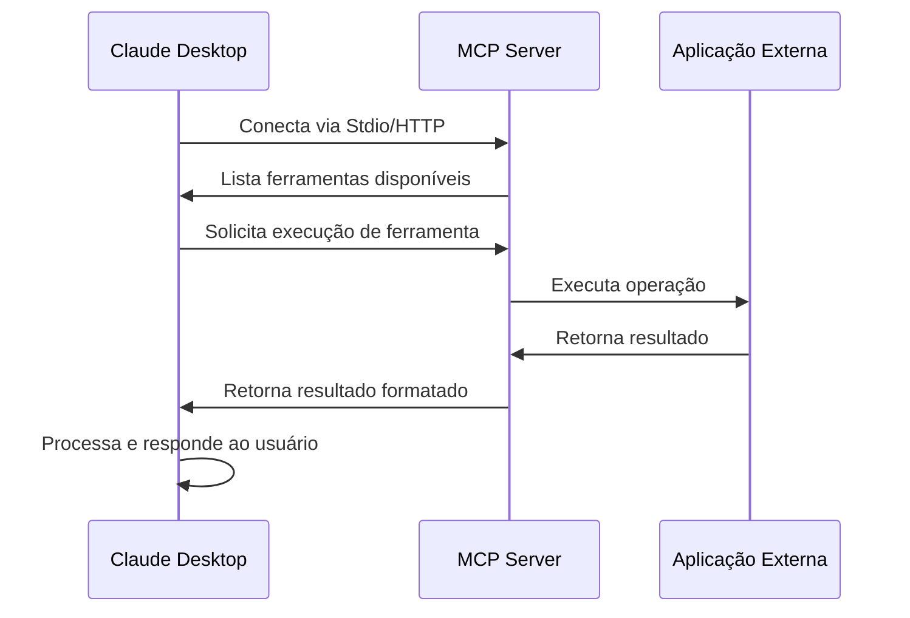
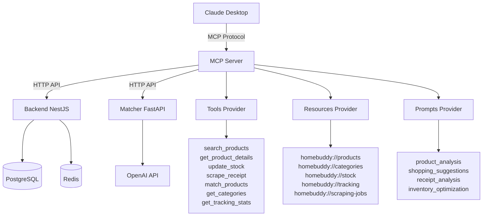
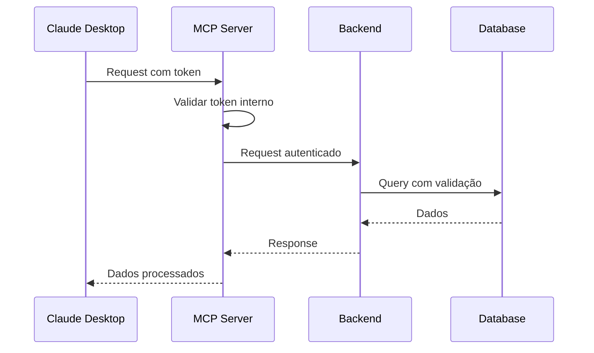

# 🤖 MCP Server - Visão Geral

O **Model Context Protocol (MCP) Server** do Home Buddy é um servidor que permite que modelos de IA como Claude acessem diretamente os dados e funcionalidades do sistema de forma segura e padronizada.

## 🎯 O que é o MCP?

O **Model Context Protocol (MCP)** é um protocolo padrão desenvolvido pela Anthropic que permite que modelos de linguagem grande (LLMs) como Claude se conectem a fontes de dados e ferramentas externas de forma segura e controlada.

### 🌟 Por que o MCP é Importante?

#### **1. Padronização**

- **Problema**: Cada LLM tinha sua própria forma de integrar com ferramentas externas
- **Solução**: MCP cria um padrão universal para comunicação
- **Benefício**: Desenvolvedores podem criar uma integração que funciona com qualquer LLM compatível

#### **2. Segurança**

- **Problema**: LLMs precisam acessar dados sensíveis de forma segura
- **Solução**: MCP implementa autenticação e autorização robustas
- **Benefício**: Controle granular sobre o que o LLM pode acessar

#### **3. Flexibilidade**

- **Problema**: Diferentes aplicações precisam de diferentes tipos de integração
- **Solução**: MCP suporta Tools, Resources e Prompts
- **Benefício**: Adaptável a qualquer caso de uso

### 🔧 Como Funciona o MCP?



### 🏗️ Arquitetura do MCP

#### **Componentes Principais**

1. **MCP Server**: Servidor que expõe ferramentas e recursos
2. **MCP Client**: Cliente (como Claude Desktop) que consome as ferramentas
3. **Transport Layer**: Comunicação entre cliente e servidor (Stdio/HTTP)
4. **Authentication**: Sistema de autenticação seguro

#### **Tipos de Integração**

- **Tools**: Funções executáveis pelo LLM
- **Resources**: Dados acessíveis pelo LLM
- **Prompts**: Templates contextuais para interações

### 🔑 Conceitos Principais

- **Tools (Ferramentas)**: Funções que o LLM pode executar
- **Resources (Recursos)**: Dados que o LLM pode ler
- **Prompts (Prompts)**: Templates contextuais para interações

## 🏗️ Arquitetura do MCP Server



## 🚀 Funcionalidades Disponíveis

### 🛠️ Tools (Ferramentas)

| Tool                  | Descrição                           | Parâmetros                                     |
| --------------------- | ----------------------------------- | ---------------------------------------------- |
| `search_products`     | Busca produtos no catálogo          | `query`, `categoryId`, `userId`, `limit`       |
| `get_product_details` | Obtém detalhes de um produto        | `productId`, `userId`                          |
| `update_stock`        | Atualiza estoque de produtos        | `productId`, `userId`, `quantity`, `operation` |
| `scrape_receipt`      | Inicia scraping de notas fiscais    | `url`, `userId`                                |
| `match_products`      | Executa matching inteligente com IA | `scrapedProducts`, `userId`                    |
| `get_categories`      | Lista categorias de produtos        | `userId`                                       |
| `get_tracking_stats`  | Obtém estatísticas de tracking      | `userId`, `period`                             |

### 📚 Resources (Recursos)

| Resource          | Descrição                     | URI                         |
| ----------------- | ----------------------------- | --------------------------- |
| **Produtos**      | Catálogo completo de produtos | `homebuddy://products`      |
| **Categorias**    | Lista de categorias           | `homebuddy://categories`    |
| **Estoque**       | Informações de estoque        | `homebuddy://stock`         |
| **Tracking**      | Logs e métricas de tracking   | `homebuddy://tracking`      |
| **Scraping Jobs** | Status de jobs de scraping    | `homebuddy://scraping-jobs` |

### 💬 Prompts (Prompts Contextuais)

| Prompt                   | Descrição                           | Contexto                                  |
| ------------------------ | ----------------------------------- | ----------------------------------------- |
| `product_analysis`       | Análise inteligente de produtos     | Análise detalhada de produtos específicos |
| `shopping_suggestions`   | Sugestões de compras personalizadas | Recomendações baseadas no histórico       |
| `receipt_analysis`       | Análise de notas fiscais            | Processamento e análise de compras        |
| `inventory_optimization` | Otimização de estoque               | Sugestões para melhorar gestão            |

## 🔒 Segurança

### 🛡️ Medidas de Segurança

- **Autenticação por Token**: Token interno para comunicação segura
- **Validação Rigorosa**: Validação de entrada com Zod
- **Timeouts Configuráveis**: Prevenção de requests infinitos
- **Logs de Auditoria**: Rastreamento completo de operações

### 🔐 Fluxo de Autenticação



## 📊 Benefícios

### 🎯 Para o Usuário

- **Acesso Natural**: Interaja com seus dados usando linguagem natural
- **Análise Inteligente**: Claude analisa seus produtos e estoque
- **Sugestões Personalizadas**: Recomendações baseadas em seus dados
- **Automação**: Execute tarefas complexas com comandos simples

### 🔧 Para Desenvolvedores

- **Padronização**: Interface universal para LLMs
- **Extensibilidade**: Fácil adição de novas funcionalidades
- **Monitoramento**: Logs e métricas completas
- **Segurança**: Controle granular de acesso

## 🌟 Casos de Uso

### 🛒 Gestão de Compras

```
Claude, analise meu estoque e me dê sugestões de compras para esta semana
Claude, busque produtos de "limpeza" que estão com estoque baixo
Claude, faça scraping desta nota fiscal e adicione os produtos ao meu catálogo
```

### 📈 Análise de Dados

```
Claude, me mostre estatísticas dos meus produtos mais consumidos
Claude, analise os custos de IA do último mês
Claude, identifique padrões nas minhas compras
```

### 🔄 Automação

```
Claude, atualize o estoque de todos os produtos da categoria "limpeza"
Claude, execute matching inteligente para estes produtos extraídos
Claude, gere um relatório de otimização de estoque
```

## 🛠️ Como Criar um MCP Server

### 📋 Pré-requisitos

- **Node.js** 18+ ou **Python** 3.8+
- **Conhecimento** básico de APIs REST
- **Entendimento** do protocolo MCP
- **Acesso** aos dados/funcionalidades que deseja expor

### 🚀 Passos Básicos

#### **1. Escolher Tecnologia**

```bash
# TypeScript/Node.js (Recomendado)
npm init -y
npm install @modelcontextprotocol/sdk

# Python
pip install mcp
```

#### **2. Estrutura Básica**

```typescript
// server.ts
import { Server } from '@modelcontextprotocol/sdk/server/index.js'
import { StdioServerTransport } from '@modelcontextprotocol/sdk/server/stdio.js'

const server = new Server(
  { name: 'meu-mcp-server', version: '1.0.0' },
  { capabilities: { tools: {} } },
)

// Registrar ferramentas
server.setRequestHandler(ListToolsRequestSchema, async () => ({
  tools: [
    {
      name: 'minha_ferramenta',
      description: 'Descrição da ferramenta',
      inputSchema: {
        type: 'object',
        properties: {
          parametro: { type: 'string' },
        },
      },
    },
  ],
}))

// Executar ferramenta
server.setRequestHandler(CallToolRequestSchema, async (request) => {
  if (request.params.name === 'minha_ferramenta') {
    return {
      content: [
        {
          type: 'text',
          text: `Resultado: ${request.params.arguments.parametro}`,
        },
      ],
    }
  }
})
```

#### **3. Configurar Claude Desktop**

```json
{
  "mcpServers": {
    "meu-server": {
      "command": "node",
      "args": ["/caminho/para/server.js"]
    }
  }
}
```

### 🎯 Melhores Práticas

#### **1. Validação de Entrada**

```typescript
import { z } from 'zod'

const ToolSchema = z.object({
  parametro: z.string().min(1),
})

// Validar antes de processar
const validatedInput = ToolSchema.parse(request.params.arguments)
```

#### **2. Tratamento de Erros**

```typescript
try {
  const result = await minhaOperacao()
  return { content: [{ type: 'text', text: result }] }
} catch (error) {
  return {
    content: [{ type: 'text', text: `Erro: ${error.message}` }],
    isError: true,
  }
}
```

#### **3. Logging e Monitoramento**

```typescript
console.error(
  `[${new Date().toISOString()}] Tool: ${toolName}, User: ${userId}`,
)
```

#### **4. Segurança**

```typescript
// Autenticação
const token = request.headers.authorization
if (!isValidToken(token)) {
  throw new Error('Token inválido')
}

// Rate limiting
const userRequests = getUserRequestCount(userId)
if (userRequests > LIMIT) {
  throw new Error('Rate limit excedido')
}
```

### 📚 Recursos Adicionais

- **[Especificação MCP](https://modelcontextprotocol.info/)**: Documentação oficial
- **[SDK TypeScript](https://github.com/modelcontextprotocol/typescript-sdk)**: SDK oficial
- **[Exemplos Oficiais](https://github.com/modelcontextprotocol/servers)**: Servidores de exemplo
- **[Claude Desktop](https://claude.ai/download)**: Cliente oficial

## 🚀 Próximos Passos

1. **[Instalação e Configuração](./installation.md)** - Configure o MCP Server
2. **[Integração com Claude](./integration.md)** - Conecte com Claude Desktop
3. **[API e Ferramentas](./api.md)** - Explore todas as funcionalidades
4. **[Exemplos Práticos](./examples.md)** - Veja casos de uso reais

---

**🎉 O MCP Server transforma o Home Buddy em um assistente inteligente que entende seus dados e pode ajudá-lo de forma natural e eficiente!**
